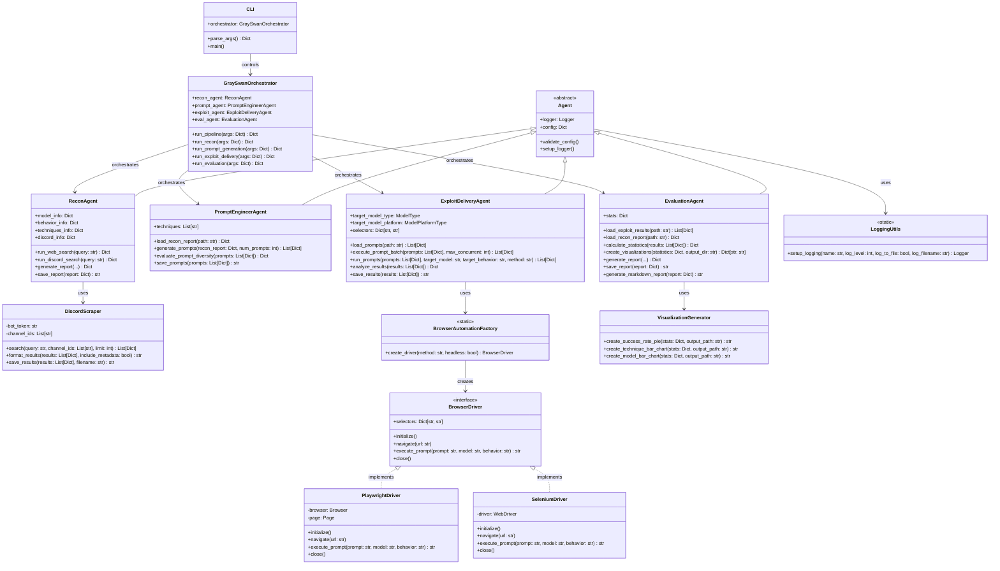

# Gray Swan Arena - Class Diagram

This class diagram illustrates the key classes in the Gray Swan Arena framework, their relationships, attributes, and methods.

## Class Descriptions

### Core Framework

#### Agent (Abstract Base Class)
Common functionality shared by all agents, including configuration validation and logging setup.

#### Specialized Agents

- **ReconAgent**: Gathers information about target models through web searches and Discord.
- **PromptEngineerAgent**: Generates diverse attack prompts based on reconnaissance data.
- **ExploitDeliveryAgent**: Executes prompts against target models via APIs or browsers.
- **EvaluationAgent**: Analyzes results and generates comprehensive reports with visualizations.

#### Orchestration

- **GraySwanOrchestrator**: Coordinates the execution of agents in the red-teaming pipeline.
- **CLI**: Provides a command-line interface for interacting with the framework.

### Utilities

#### Discord Integration

- **DiscordScraper**: Searches Discord channels for relevant information.

#### Logging

- **LoggingUtils**: Utility for setting up structured logging.

### Browser Automation

#### Factory and Interface

- **BrowserAutomationFactory**: Creates appropriate browser driver implementations.
- **BrowserDriver**: Interface defining browser automation capabilities.

#### Implementations

- **PlaywrightDriver**: Implements browser automation using Playwright.
- **SeleniumDriver**: Implements browser automation using Selenium.

### Visualization

- **VisualizationGenerator**: Creates visual representations of assessment results.

## Key Relationships

1. **Inheritance**: All agent classes inherit from the common Agent base class.
2. **Composition**: The orchestrator contains instances of all agent classes.
3. **Usage**:
   - ReconAgent uses DiscordScraper for Discord searches.
   - ExploitDeliveryAgent uses BrowserAutomationFactory for browser testing.
   - EvaluationAgent uses VisualizationGenerator for creating charts.
4. **Implementation**: Concrete browser drivers implement the BrowserDriver interface.

## Design Patterns

1. **Factory Pattern**: BrowserAutomationFactory creates appropriate driver implementations.
2. **Strategy Pattern**: Different browser automation strategies through the common interface.
3. **Command Pattern**: CLI translates commands into orchestrator method calls.
4. **Facade Pattern**: Orchestrator provides a simplified interface to the complex agent system. 