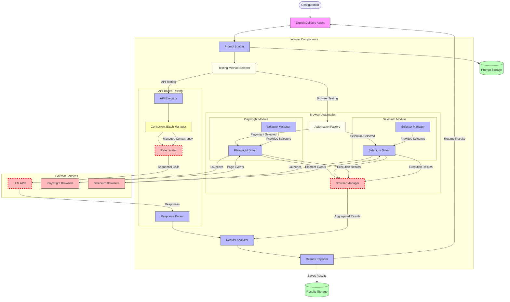

# Exploit Delivery Agent - Detailed Architecture

This diagram provides a detailed view of the Exploit Delivery Agent's internal architecture, showing how it handles both API-based testing and browser automation workflows.

## Agent Architecture Components

### Core Components
- **Exploit Delivery Agent**: Main agent coordinating the exploit testing process
- **Prompt Loader**: Loads prompt lists from storage
- **Method Selector**: Decides between API-based testing and browser automation
- **Results Analyzer**: Analyzes test results to determine success rates
- **Reporter**: Generates detailed reports on test results

### API Testing Components
- **API Executor**: Manages the API-based testing workflow
- **Batch Manager**: Handles concurrent execution of multiple prompts
- **Rate Limiter**: Controls request rates to avoid API throttling
- **Response Parser**: Parses and analyzes model responses

### Browser Automation Components
- **Automation Factory**: Selects and initializes the appropriate browser automation library
- **Browser Manager**: Coordinates browser interactions and result collection
- **Playwright Module**: Implements browser automation using Playwright
- **Selenium Module**: Alternative implementation using Selenium WebDriver

## Critical Flows

### API Testing Flow
1. Load prompts from storage
2. Select API testing method
3. Configure the API executor with model parameters
4. Process prompts in concurrent batches with rate limiting
5. Send requests to LLM APIs
6. Parse and analyze responses
7. Generate and store results

### Browser Automation Flow
1. Load prompts from storage
2. Select browser automation method (Playwright or Selenium)
3. Initialize the appropriate browser driver
4. Configure selectors for the target web interface
5. Execute prompts through the browser interface
6. Collect and process responses
7. Generate and store results

## Bottlenecks & Complexities

### Performance Bottlenecks
- **Rate Limiting**: API rate limits can slow down testing
- **Browser Automation**: Browser interaction is slower than direct API calls
- **Response Processing**: Parsing complex responses requires significant processing

### Key Decision Points
- **Method Selection**: Choosing between API and browser testing
- **Automation Library**: Selecting Playwright or Selenium based on compatibility
- **Concurrency Management**: Balancing performance with rate limits

## Integration Points
- **Configuration**: Environment variables for API keys and settings
- **Prompt Storage**: Loading prompt lists from storage
- **Results Storage**: Saving test results for evaluation
- **External Services**: Interaction with LLM APIs and browsers 