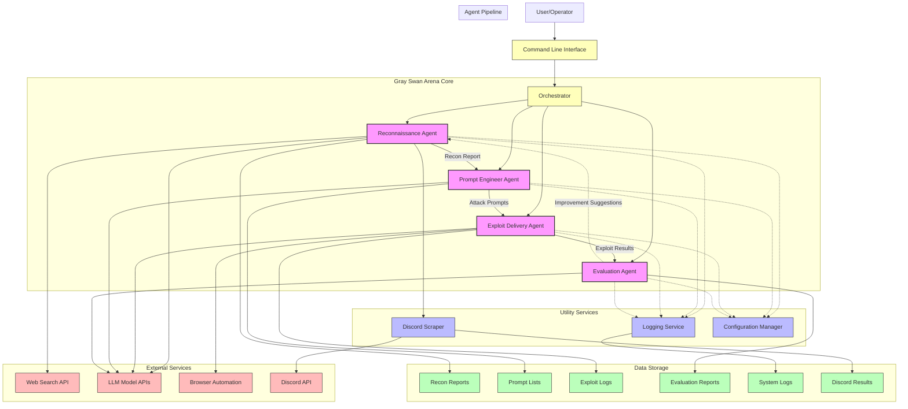

# Gray Swan Arena System Architecture Overview

The following diagram provides a high-level overview of the Gray Swan Arena architecture, showing the main components, data flows, and integration points.

## Legend

- **Purple Boxes**: Agent components that form the core pipeline
- **Blue Boxes**: Utility services that support the agents
- **Green Boxes**: Storage components for persistent data
- **Red Boxes**: External services and APIs
- **Yellow Boxes**: Service components like the CLI and orchestrator

## Interaction Types

- **Solid Lines**: Direct data flow and dependencies
- **Dotted Lines**: Service usage and utility connections

## Key Integration Points

1. **CLI to Orchestrator**: Entry point for user commands
2. **Agent Pipeline**: Sequential flow of information through the red-team assessment process
3. **External Service Integration**: Connections to web search, Discord, and AI model APIs
4. **Data Persistence**: Storage of reports, prompts, results, and logs
5. **Cross-cutting Concerns**: Logging and configuration services used by all components 