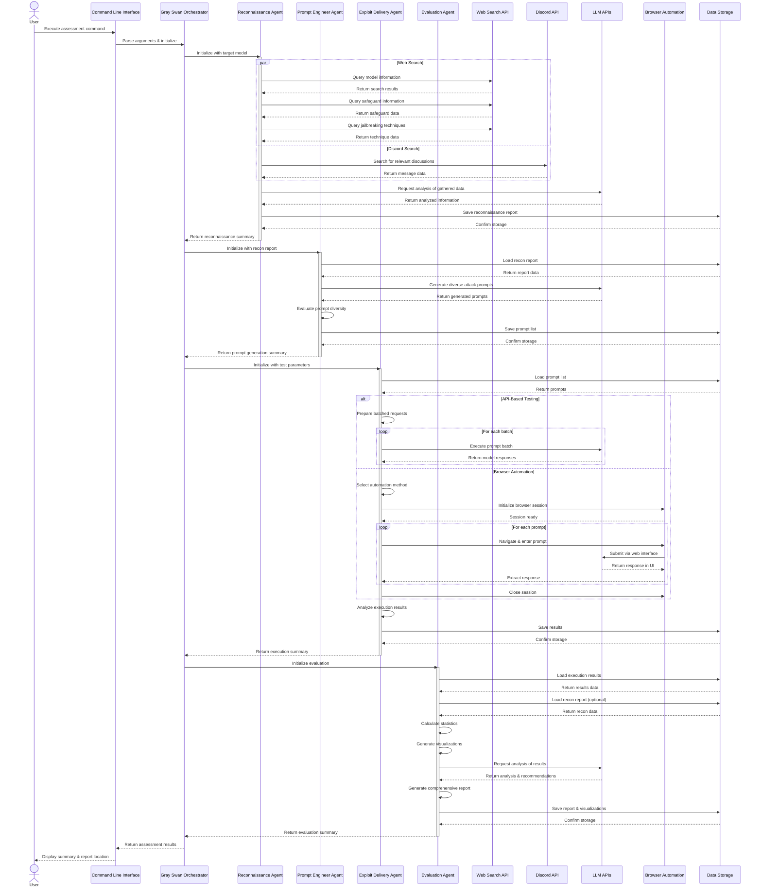

# Gray Swan Arena - End-to-End Workflow Sequence

This sequence diagram illustrates the complete workflow of a red-team assessment using the Gray Swan Arena framework, showing interactions between components, data flow, and key operations.

## Workflow Description

### Setup & Initialization
1. **User Invocation**: The user starts the assessment via command line
2. **Parameter Parsing**: The CLI parses arguments and initializes the orchestrator
3. **Assessment Configuration**: The orchestrator sets up the assessment parameters

### Phase 1: Reconnaissance
1. **Information Gathering**: The Reconnaissance Agent searches the web and Discord for information about:
   - Target model capabilities
   - Model safeguards
   - Known jailbreaking techniques
2. **Data Analysis**: Using LLMs to analyze and structure the gathered information
3. **Report Generation**: Creating a comprehensive reconnaissance report

### Phase 2: Prompt Engineering
1. **Recon Data Loading**: Loading the reconnaissance report
2. **Prompt Generation**: Using LLMs to generate diverse attack prompts based on:
   - Target model information
   - Identified vulnerabilities
   - Effective techniques
3. **Diversity Analysis**: Ensuring a broad coverage of attack vectors
4. **Prompt Storage**: Saving the generated prompts for the next phase

### Phase 3: Exploit Delivery
1. **Testing Method Selection**: Choosing between API-based testing or browser automation
2. **Execution Preparation**: Loading prompts and preparing the testing environment
3. **Execution Process**:
   - **API-Based**: Batched execution with rate limiting
   - **Browser**: Sequential execution through web interfaces
4. **Results Collection**: Gathering responses and analyzing success rates
5. **Results Storage**: Saving detailed execution results

### Phase 4: Evaluation
1. **Data Loading**: Loading execution results and reconnaissance data
2. **Statistical Analysis**: Calculating comprehensive statistics
3. **Visualization Generation**: Creating visual representations of the results
4. **AI-Assisted Analysis**: Using LLMs to analyze patterns and generate insights
5. **Report Generation**: Creating structured JSON and human-readable markdown reports
6. **Storage**: Saving all reports and visualizations

### Completion
1. **Summary Generation**: The orchestrator compiles a summary of the assessment
2. **User Communication**: The CLI displays the summary and report locations

## Key Interactions

### External Service Interactions
- **Web Search API**: Used for gathering information about models and techniques
- **Discord API**: Used for community knowledge extraction
- **LLM APIs**: Used throughout for:
  - Analysis of gathered information
  - Generation of prompts
  - Target of exploit attempts
  - Analysis of results

### Data Flows
- **Reconnaissance → Prompt Engineering**: Model information and vulnerability data
- **Prompt Engineering → Exploit Delivery**: Diverse attack prompts
- **Exploit Delivery → Evaluation**: Execution results
- **Evaluation → Final Report**: Comprehensive analysis and recommendations

### Parallel Processing
- Web and Discord searches run in parallel during reconnaissance
- Batched API calls can run concurrently during exploit delivery

## Asynchronous Operations
- Web searches
- Discord searches
- Batched API calls
- Browser automation operations 