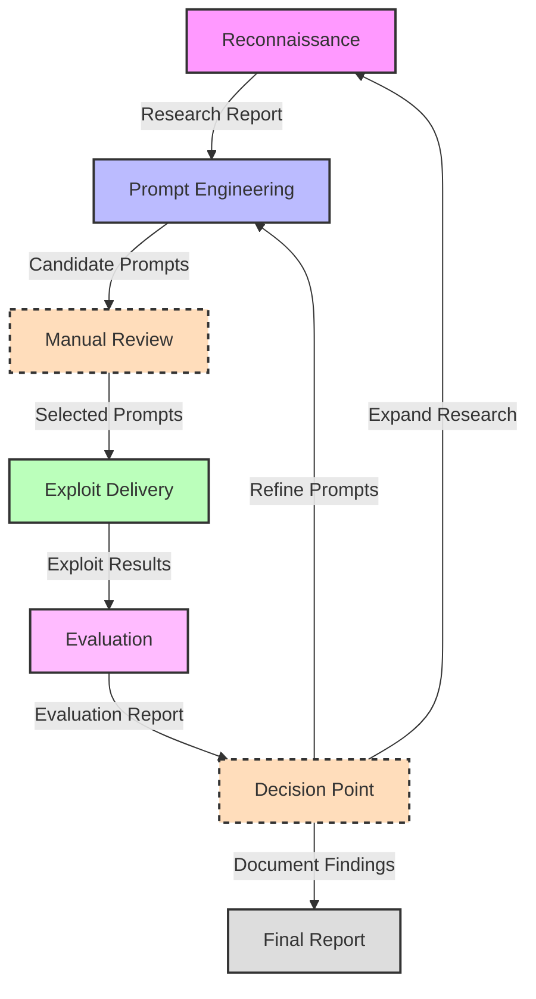

# Gray Swan Arena Agent Usage Plan

This document outlines the plan for using the Gray Swan Arena agents to generate effective prompts for AI challenges, focusing on information accuracy, reasoning, and logic.

## Overview

The plan involves a four-phase process, with manual steps for prompt submission and result observation. The agents will be used with their default settings.

## Phases

### Phase 1: Reconnaissance (Manual)

*   **Action:** Utilize the information provided by the user as the reconnaissance data. This includes the list of AI challenges, the target models, and the prompts that have been tested.
*   **Input:** User-provided information.
*   **Output:** Reconnaissance data ready for prompt engineering.

### Phase 2: Prompt Engineering (PromptEngineerAgent)

*   **Action:** Initialize the `PromptEngineerAgent` with default settings. Use the `generate_prompts` method to create prompts.
*   **Input:**
    *   `target_model`: The specific AI model to be tested (e.g., "Brass Crab Legendary").
    *   `target_behavior`: The desired behavior to test (e.g., "information accuracy", "reasoning and logic").
    *   `recon_report`: The user-provided reconnaissance data.
    *   `num_prompts`: The number of prompts to generate (e.g., 10).
*   **Output:** A list of generated prompts.
*   **Manual Step:** The user will review the generated prompts.

### Phase 3: Exploit Delivery (Manual)

*   **Action:** Manually submit the prompts generated by the `PromptEngineerAgent` to the target model's web interface.
*   **Input:** The prompts generated in Phase 2.
*   **Output:** The target model's responses.
*   **Manual Step:** The user will observe the model's responses.

### Phase 4: Evaluation (EvaluationAgent)

*   **Action:** Initialize the `EvaluationAgent` with default settings. Use the `evaluate_results` method to analyze the results. Generate a summary report and visualizations.
*   **Input:**
    *   `results`: The responses observed in Phase 3.
    *   `target_model`: The same target model as in Phase 2.
    *   `target_behavior`: The same target behavior as in Phase 2.
*   **Output:**
    *   Evaluation results.
    *   A summary report.
    *   Visualizations (e.g., success rate pie chart, success rate by method bar chart).
*   **Manual Step:** The user will review the evaluation results, summary, and visualizations.

## Iteration

*   Based on the evaluation results, the user can provide feedback to the `PromptEngineerAgent` to refine the prompts.
*   Phases 2-4 can be repeated iteratively to improve the prompts and the results.

## Mermaid Diagram

```mermaid
graph LR
    A[Start] --> B{Phase 1: Reconnaissance (Manual)};
    B --> C{Phase 2: Prompt Engineering (PromptEngineerAgent)};
    C --> D[Generate Prompts];
    D --> E[Review Prompts (Manual)];
    E --> F{Phase 3: Exploit Delivery (Manual)};
    F --> G[Submit Prompts (Manual)];
    G --> H[Observe Responses (Manual)];
    H --> I{Phase 4: Evaluation (EvaluationAgent)};
    I --> J[Evaluate Results];
    J --> K[Generate Summary & Visualizations];
    K --> L[Review Results (Manual)];
    L --> M{Iteration: Refine Prompts};
    M --> C;
    M --> N[End];
    L --> N;
    
```

## Agent Definitions and Default Settings

1. **Recon Agent**
   - Model: gpt-4
   - Backup Model: gpt-4o
   - Reasoning Model: gpt-4
   - Temperature: 0.7
   - Purpose: Gathers information about potential exploits and vulnerabilities

2. **Prompt Engineer Agent**
   - Model: gpt-4o
   - Reasoning Model: o3-mini
   - Temperature: 0.9
   - Purpose: Creates sophisticated prompts designed to test model boundaries

3. **Exploit Delivery Agent**
   - Model: gpt-4
   - Backup Model: gpt-3.5-turbo
   - Temperature: 0.8
   - Purpose: Delivers the prompts to target models and captures responses

4. **Evaluation Agent**
   - Model: o3-mini
   - Backup Model: gpt-4o
   - Reasoning Model: o3-mini
   - Temperature: 0.4
   - Max Retries: 3
   - Initial Retry Delay: 1.0 (seconds)
   - Purpose: Analyzes results to determine exploit effectiveness

## Process Phases

### Phase 1: Reconnaissance

**Input**: Research topic or vulnerability category

**Actions**:
1. Recon agent gathers information about:
   - Known LLM vulnerabilities
   - Similar exploit patterns
   - Academic research
   - Technical specifications

**Parameters**:
- `research_topic`: String describing the area to investigate
- `depth`: Integer (1-5) specifying search depth
- `sources`: List of source types to prioritize (e.g., ["academic", "technical", "security"])

**Output**: Research report with:
- Vulnerability categorization
- Potential exploit vectors
- Relevant technical details
- References

**Manual Steps**: 
- Review and refine research focus
- Prioritize promising exploit vectors

### Phase 2: Prompt Engineering

**Input**: Research report from Phase 1

**Actions**:
1. Prompt Engineer agent generates exploit prompts based on research
2. Prompts are categorized by attack vector and complexity

**Parameters**:
- `research_data`: Dictionary containing reconnaissance findings
- `target_models`: List of language models to target
- `exploit_types`: List of exploit categories to focus on
- `complexity_level`: Integer (1-5) indicating complexity of generated prompts
- `num_prompts`: Integer specifying how many prompts to generate

**Output**: Collection of candidate prompts designed to:
- Exploit specific model vulnerabilities
- Test model boundaries
- Elicit problematic responses

**Manual Steps**:
- Review generated prompts
- Select most promising candidates
- Refine prompts if needed

### Phase 3: Exploit Delivery

**Input**: Selected prompts from Phase 2

**Actions**:
1. Exploit Delivery agent submits prompts to target language models
2. Responses are collected and organized

**Parameters**:
- `prompts`: List of prompt texts to test
- `target_models`: Dictionary mapping model identifiers to model configurations
- `delivery_settings`: Dictionary containing API settings and rate limiting parameters
- `result_format`: String specifying how to format the results

**Output**: Results including:
- Model responses to each prompt
- Response metrics (time, tokens, etc.)
- Success/failure indicators

**Manual Steps**:
- Monitor delivery process
- Adjust delivery parameters if needed

### Phase 4: Evaluation

**Input**: Results from Phase 3

**Actions**:
1. Evaluation agent analyzes responses against exploitation criteria
2. Generates comprehensive evaluation report
3. Creates visualizations of results

**Parameters**:
- `results`: List of dictionaries containing the exploit delivery results 
- `target_model`: String identifying the evaluated model
- `target_behavior`: String describing the expected exploitation behavior
- `evaluation_criteria`: Dictionary of criteria and weights for scoring responses
- `visualization_types`: List of visualization types to generate

**Output**: Evaluation including:
- Success rate analysis
- Response pattern categorization
- Exploitation effectiveness metrics
- Recommendations for prompt refinement

**Manual Steps**:
- Review evaluation results
- Decide on iteration strategy
- Document findings for stakeholders

## Iteration

The process is designed to be iterative, with each phase informing improvements for subsequent runs:

1. **Prompt Refinement Loop**: Based on evaluation results, prompts can be refined and retested
2. **Technique Expansion**: Successful techniques can be expanded upon in new reconnaissance
3. **Coverage Improvement**: Unsuccessful approaches can be analyzed to improve coverage

Each iteration captures metrics to track improvement over time, with the framework allowing for automated batch testing of prompts across multiple models.

## Workflow Diagram



## Configuration Options

Each agent can be configured through either:
1. Command-line arguments when initializing agents
2. Configuration files in JSON or YAML format
3. Environment variables for sensitive settings

Model configurations, including fallback strategies and retry mechanisms, are defined in the agent initialization and can be overridden at runtime.

## Outputs and Artifacts

The process generates several artifacts stored in the specified output directories:
- Research documents (markdown and JSON)
- Prompt collections (JSON)
- Response data (JSON)
- Evaluation reports (markdown and HTML)
- Visualizations (PNG, HTML for interactive)
- Logs for each phase (text)

These artifacts provide comprehensive documentation of the exploitation research process.
