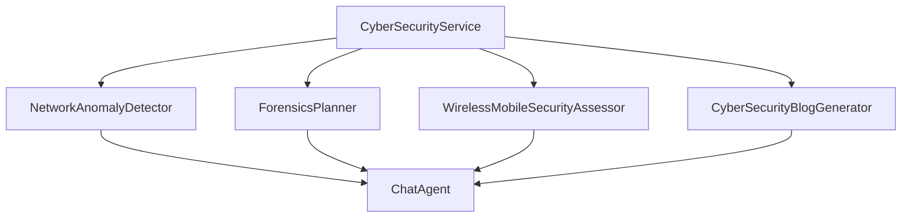

# Architecture Overview

## Core Modules

1. service_wrapper.py
- High-level interface for coordinating agents
- Manages agent lifecycle and interactions
- Handles configuration and resource management

2. network_security_agent.py
- Network traffic analysis
- Threat detection
- Security report generation

3. forensics_planner.py
- Investigation planning
- Evidence collection procedures
- Timeline generation

4. wireless_security_assessor.py
- Wireless network assessment
- Mobile security analysis
- Security recommendations

5. blog_generator.py
- Technical content generation
- Report formatting
- Content monetization

## Key Classes and Relationships

