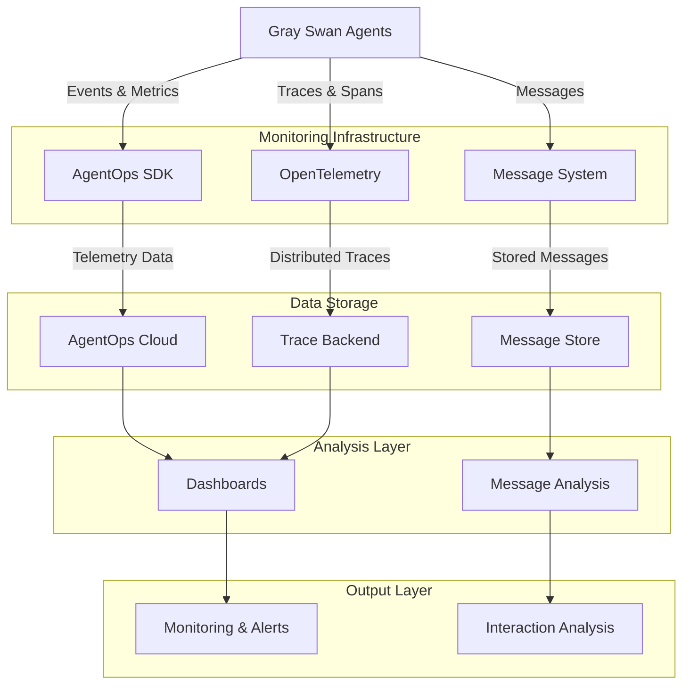
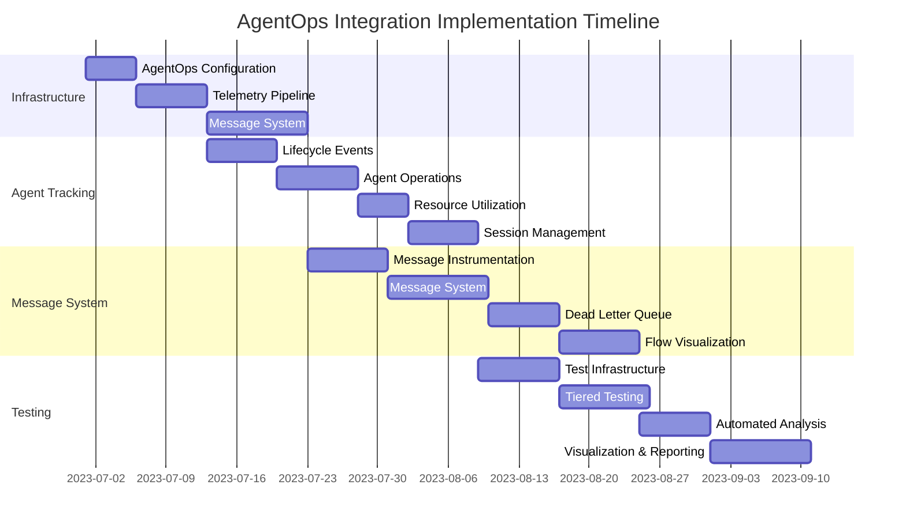

# CAMEL AgentOps Integration Plan

## Executive Summary

This document outlines a comprehensive plan for integrating AgentOps telemetry and monitoring into the Gray Swan Arena multi-agent system. The integration enables detailed tracking of agent activities, performance monitoring, and advanced analysis of multi-agent interactions. This plan covers all aspects from infrastructure setup through implementation and testing to visualization and analysis.

**Key Benefits:**
- Real-time visibility into agent operations and interactions
- Performance tracking and bottleneck identification
- Advanced behavioral analysis of LLM-powered agents
- Systematic testing framework for multi-agent systems
- Detailed reporting and visualization capabilities

**Implementation Timeline:** Approximately 6-8 weeks, divided into four phases with specific deliverables for each milestone.

**Core Components:**
1. Monitoring infrastructure
2. Agent activity tracking
3. Message exchange telemetry
4. Test framework integration
5. Analysis and visualization tools

---

## Phase 1: Infrastructure Setup

### AgentOps Configuration

1. Set up AgentOps account and obtain API key
2. Configure AgentOps SDK in project environment
3. Establish data taxonomy for agent tracking
4. Define custom metrics and events

### Telemetry Pipeline

1. Implement OpenTelemetry integration
2. Configure trace exporters and metrics collection
3. Establish logging pipeline
4. Set up local development monitoring

### Agent Message System

1. Design centralized message management
2. Implement message persistence layer
3. Create message routing and delivery mechanisms 
4. Ensure message system can track all inter-agent communications

### Infrastructure Diagram



## Phase 2: Agent Activity Tracking

### Agent Lifecycle Events

1. Initialize AgentOps in agent creation process
2. Track agent initialization parameters and settings
3. Monitor agent termination and cleanup
4. Capture performance metrics during operation

### Agent Operations

1. Instrument key agent methods
2. Track method inputs, outputs, and durations
3. Log exceptions and error conditions
4. Measure token usage and latency

### Resource Utilization

1. Track memory usage patterns
2. Monitor computational resource utilization
3. Measure token usage across agents
4. Log API rate limiting and throttling

### Session Management

1. Implement session start/end tracking
2. Group related activities into sessions
3. Enable cross-session analysis
4. Maintain context between related sessions

## Phase 3: Message Exchange Telemetry

### Message Instrumentation

1. Add unique identifiers to all messages
2. Track message lifecycle (created, sent, received, processed)
3. Capture message content and metadata
4. Measure message processing times

### Agent Message System

1. Create central message system for tracking
2. Implement store-and-forward capabilities
3. Add retry and failure handling
4. Maintain message relationship graphs

### Dead Letter Queue

1. Implement persistent storage for failed messages
2. Create recovery mechanisms for failed messages
3. Track failure patterns and error types
4. Provide admin interface for managing failed messages

### Message Flow Visualization

1. Create message sequence diagrams
2. Implement message flow tracking
3. Visualize communication patterns
4. Track message causality chains

## Phase 4: Testing & Analysis

### Test Infrastructure

1. Extend TestManager to integrate with AgentOps
2. Implement test metadata and categorization
3. Track test execution metrics
4. Measure test coverage and effectiveness

### Tiered Testing Strategy

1. Implement unit testing for agent components
2. Create integration tests for agent interactions
3. Develop scenario testing for complex workflows
4. Support chaos testing for edge cases

### Automated Analysis

1. Implement statistical analysis of agent performance
2. Track performance trends over time
3. Establish alerting thresholds
4. Create periodic performance reports

### Visualization & Reporting

1. Design comprehensive dashboards
2. Implement customizable reports
3. Create exportable visualizations
4. Enable data exploration tools

## Implementation Details

### AgentOps Integration Implementation

The core implementation will focus on these key areas:

#### 1. Agent Creation Tracking

```python
# Example for tracking agent creation
def create_agent(agent_type, **kwargs):
    try:
        # Start tracking the agent creation
        agentops.record(agentops.ActionEvent("agent_creation_started", {
            "agent_type": agent_type,
            "config": kwargs
        }))
        
        # Create the agent
        agent = AgentFactory.create(agent_type, **kwargs)
        
        # Record successful creation
        agentops.record(agentops.ActionEvent("agent_creation_completed", {
            "agent_type": agent_type,
            "agent_id": agent.id,
            "status": "success"
        }))
        
        return agent
    except Exception as e:
        # Record failure
        agentops.record(agentops.ActionEvent("agent_creation_failed", {
            "agent_type": agent_type,
            "error": str(e),
            "status": "failure"
        }))
        raise
```

#### 2. Agent Method Instrumentation

```python
# Example decorator for instrumenting agent methods
def track_agent_method(func):
    @functools.wraps(func)
    def wrapper(self, *args, **kwargs):
        # Record method start
        start_time = time.time()
        method_name = func.__name__
        
        agentops.record(agentops.ActionEvent("agent_method_started", {
            "agent_id": self.id,
            "agent_type": self.type,
            "method": method_name,
            "args_summary": summarize_args(args, kwargs)
        }))
        
        try:
            # Call the original method
            result = func(self, *args, **kwargs)
            
            # Record successful completion
            duration = time.time() - start_time
            agentops.record(agentops.ActionEvent("agent_method_completed", {
                "agent_id": self.id,
                "agent_type": self.type,
                "method": method_name,
                "duration": duration,
                "status": "success",
                "result_summary": summarize_result(result)
            }))
            
            return result
        except Exception as e:
            # Record failure
            duration = time.time() - start_time
            agentops.record(agentops.ActionEvent("agent_method_failed", {
                "agent_id": self.id,
                "agent_type": self.type,
                "method": method_name,
                "duration": duration,
                "status": "failure",
                "error": str(e),
                "error_type": type(e).__name__
            }))
            
            # Re-raise the exception
            raise
    
    return wrapper
```

#### 3. Message System Integration

```python
# Example for tracking messages between agents
class MessageSystem:
    def __init__(self):
        self.message_store = MessageStore()
        self.dead_letter_queue = DeadLetterQueue()
    
    def send_message(self, message, sender_id, receiver_id):
        # Generate unique message ID
        message_id = str(uuid.uuid4())
        message_with_meta = {
            "id": message_id,
            "content": message,
            "sender_id": sender_id,
            "receiver_id": receiver_id,
            "timestamp": time.time(),
            "status": "sent"
        }
        
        # Track message sending
        agentops.record(agentops.ActionEvent("message_sent", {
            "message_id": message_id,
            "sender_id": sender_id,
            "receiver_id": receiver_id,
            "content_length": len(str(message)),
            "content_type": determine_content_type(message)
        }))
        
        try:
            # Attempt to deliver the message
            self.message_store.store(message_with_meta)
            success = self.deliver_message(message_with_meta)
            
            if success:
                # Update message status
                self.message_store.update_status(message_id, "delivered")
                
                # Track successful delivery
                agentops.record(agentops.ActionEvent("message_delivered", {
                    "message_id": message_id,
                    "delivery_time": time.time() - message_with_meta["timestamp"]
                }))
                
                return True
            else:
                # Move to dead letter queue
                self.message_store.update_status(message_id, "failed")
                self.dead_letter_queue.add(message_with_meta, error="Delivery failed")
                
                # Track failed delivery
                agentops.record(agentops.ActionEvent("message_delivery_failed", {
                    "message_id": message_id,
                    "reason": "Delivery failed"
                }))
                
                return False
        except Exception as e:
            # Handle exceptions
            self.message_store.update_status(message_id, "error")
            self.dead_letter_queue.add(message_with_meta, error=str(e))
            
            # Track error
            agentops.record(agentops.ActionEvent("message_error", {
                "message_id": message_id,
                "error": str(e),
                "error_type": type(e).__name__
            }))
            
            return False
```

#### 4. Test Framework Integration

```python
# Example test manager with AgentOps integration
class TestManager:
    def __init__(self):
        self.unit_tests = []
        self.integration_tests = []
        self.scenario_tests = []
    
    def register_unit_test(self, test_func):
        self.unit_tests.append(test_func)
    
    def register_integration_test(self, test_func):
        self.integration_tests.append(test_func)
    
    def register_scenario_test(self, test_func):
        self.scenario_tests.append(test_func)
    
    def run_tests(self, test_tier):
        agentops.record(agentops.ActionEvent("test_run_started", {"tier": test_tier}))
        
        if test_tier == "unit":
            tests = self.unit_tests
        elif test_tier == "integration":
            tests = self.integration_tests
        elif test_tier == "scenario":
            tests = self.scenario_tests
        else:
            raise ValueError(f"Unknown test tier: {test_tier}")
        
        results = []
        for test_func in tests:
            test_name = test_func.__name__
            
            # Record test start
            agentops.record(agentops.ActionEvent("test_started", {
                "test_name": test_name,
                "tier": test_tier
            }))
            
            start_time = time.time()
            try:
                # Run the test
                test_func()
                success = True
                error = None
            except Exception as e:
                success = False
                error = str(e)
            
            duration = time.time() - start_time
            
            # Record test completion
            result = {
                "test_name": test_name,
                "tier": test_tier,
                "success": success,
                "duration": duration,
                "error": error
            }
            
            results.append(result)
            
            agentops.record(agentops.ActionEvent(
                "test_completed" if success else "test_failed", 
                {
                    "test_name": test_name,
                    "tier": test_tier,
                    "duration": duration,
                    "error": error
                }
            ))
        
        # Record overall results
        passed = sum(1 for r in results if r["success"])
        total = len(results)
        
        agentops.record(agentops.ActionEvent("test_run_completed", {
            "tier": test_tier,
            "total_tests": total,
            "passed_tests": passed,
            "failed_tests": total - passed,
            "pass_rate": passed / total if total > 0 else 0
        }))
        
        return results
```

#### 5. Session and Workflow Tracking

```python
# Example workflow tracking
class WorkflowManager:
    def __init__(self, workflow_name):
        self.workflow_name = workflow_name
        self.workflow_id = str(uuid.uuid4())
        self.steps = []
        self.start_time = None
        self.end_time = None
    
    def start(self):
        self.start_time = time.time()
        
        # Record workflow start
        agentops.record(agentops.ActionEvent("workflow_started", {
            "workflow_name": self.workflow_name,
            "workflow_id": self.workflow_id
        }))
    
    def add_step(self, step_name, agent_id=None):
        step_id = str(uuid.uuid4())
        step = {
            "id": step_id,
            "name": step_name,
            "agent_id": agent_id,
            "start_time": time.time(),
            "end_time": None,
            "status": "in_progress"
        }
        
        self.steps.append(step)
        
        # Record step start
        agentops.record(agentops.ActionEvent("workflow_step_started", {
            "workflow_id": self.workflow_id,
            "workflow_name": self.workflow_name,
            "step_id": step_id,
            "step_name": step_name,
            "agent_id": agent_id
        }))
        
        return step_id
    
    def complete_step(self, step_id, status="completed", result=None):
        # Find the step
        step = next((s for s in self.steps if s["id"] == step_id), None)
        
        if step:
            step["end_time"] = time.time()
            step["status"] = status
            step["result"] = result
            
            # Record step completion
            agentops.record(agentops.ActionEvent("workflow_step_completed", {
                "workflow_id": self.workflow_id,
                "workflow_name": self.workflow_name,
                "step_id": step_id,
                "step_name": step["name"],
                "status": status,
                "duration": step["end_time"] - step["start_time"],
                "result_summary": summarize_result(result) if result else None
            }))
    
    def complete(self, status="completed"):
        self.end_time = time.time()
        
        # Record workflow completion
        completed_steps = sum(1 for s in self.steps if s["status"] == "completed")
        
        agentops.record(agentops.ActionEvent("workflow_completed", {
            "workflow_id": self.workflow_id,
            "workflow_name": self.workflow_name,
            "status": status,
            "duration": self.end_time - self.start_time,
            "total_steps": len(self.steps),
            "completed_steps": completed_steps,
            "completion_rate": completed_steps / len(self.steps) if self.steps else 0
        }))
```

### Data Analysis and Visualization

The integration will power several analysis and visualization capabilities:

1. **Agent Performance Dashboards**
   - Response time distributions
   - Token usage metrics
   - Error rate tracking
   - Resource utilization

2. **Interaction Flow Visualization**
   - Message sequence diagrams
   - Agent communication graphs
   - Workflow execution timelines
   - Dependency mapping

3. **Anomaly Detection**
   - Unusual behavior patterns
   - Performance degradation alerts
   - Error clustering
   - Bottleneck identification

4. **Test Coverage Analysis**
   - Test execution heatmaps
   - Coverage metrics
   - Reliability scoring
   - Regression detection

## Integration Improvements and Future Directions

### Enhanced Agent Coordination

1. **Centralized Orchestration**
   - Implement central coordination mechanism
   - Enable observation of multi-agent interactions
   - Support dynamic agent allocation

2. **Adaptive Behavior**
   - Data-driven agent configuration
   - Performance-based model selection
   - Dynamic resource allocation

3. **Collaboration Patterns**
   - Track effective collaboration sequences
   - Optimize agent team compositions
   - Identify communication redundancies

### Advanced Analytics

1. **Predictive Performance Models**
   - Forecast resource requirements
   - Predict completion times
   - Anticipate bottlenecks

2. **Agent Behavior Classification**
   - Identify emergent agent behaviors
   - Categorize interaction patterns
   - Track strategy evolution

3. **Causal Analysis**
   - Determine error root causes
   - Identify performance influencers
   - Track impact of configuration changes

## Implementation Timeline



## Conclusion

The integration of AgentOps telemetry into the Gray Swan Arena will provide comprehensive visibility into agent operations, enabling improved reliability, performance, and observability. This implementation will support both development and production environments, offering insights that drive continuous improvement of the multi-agent system.