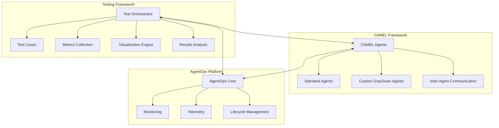
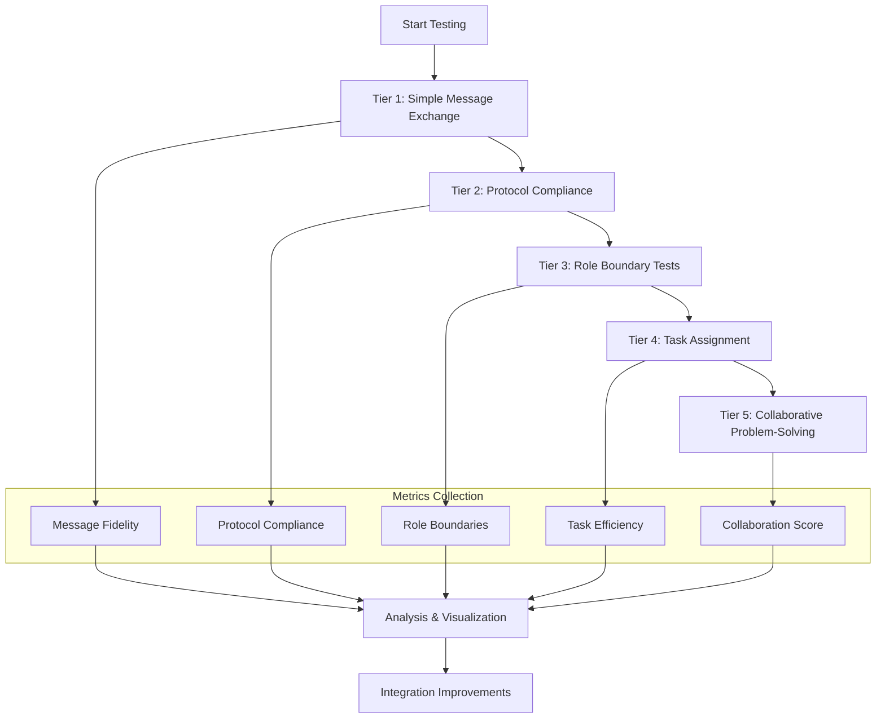
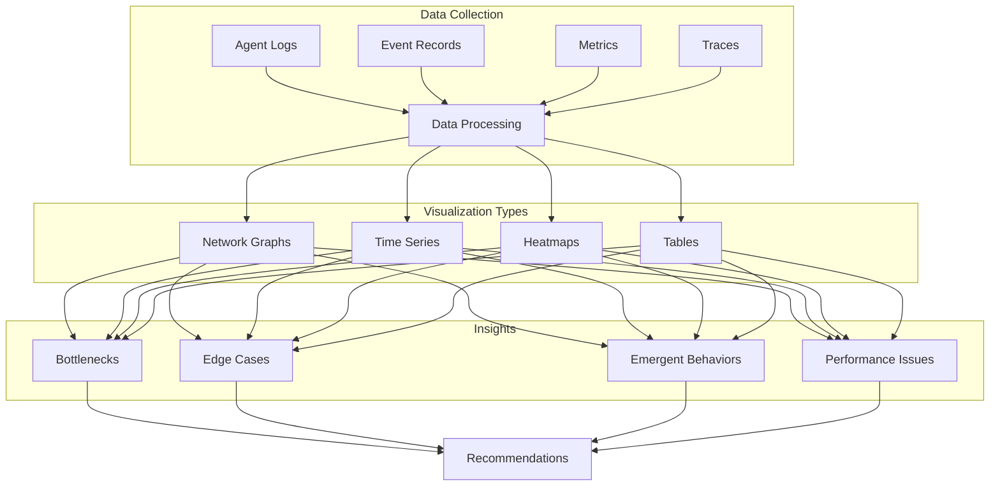
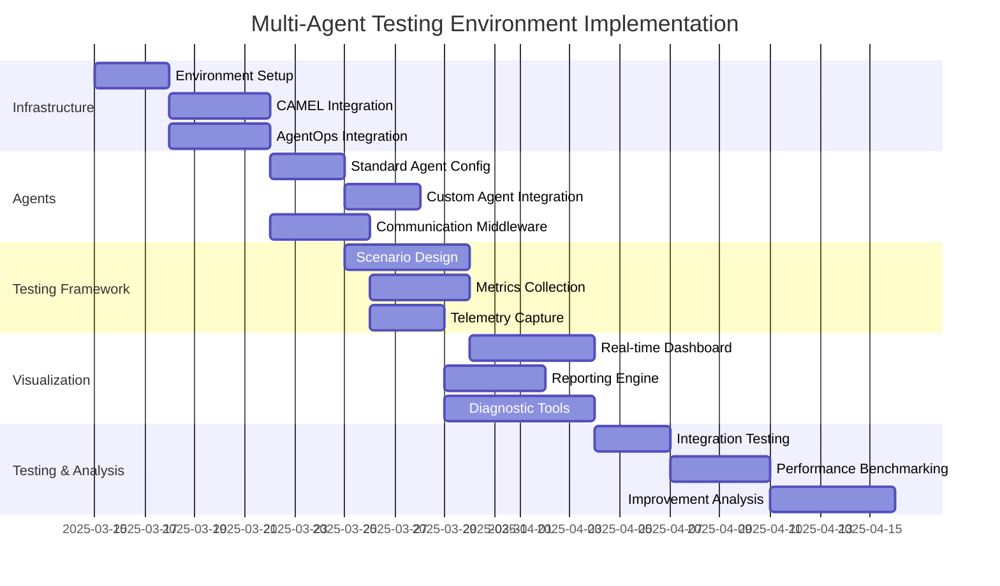

# Multi-Agent Testing Environment: CAMEL + AgentOps Integration Plan

## 1. System Architecture Overview



## 2. Implementation Plan 

### Phase 1: Infrastructure Setup (Foundation)

1. **Testing Environment Configuration**
   - Create a dedicated testing module structure
   - Set up configuration files for environment variables
   - Implement logging infrastructure for test outputs

2. **CAMEL Integration Framework**
   - Import and configure standard CAMEL agents
   - Create agent factory patterns for dynamic agent instantiation
     - Implement a flexible factory pattern using dependency injection
     - Support configuration-based agent creation with parameter overrides
     - Enable dynamic role assignment based on test scenarios
     - Example implementation:
       ```python
       class AgentFactory:
           def __init__(self, config_manager, model_provider):
               self.config_manager = config_manager
               self.model_provider = model_provider
               self.agent_registry = {}
            
           def register_agent_type(self, agent_type, agent_class):
               """Register an agent type with its implementation class"""
               self.agent_registry[agent_type] = agent_class
            
           def create_agent(self, agent_type, role, **kwargs):
               """Create an agent instance with specified parameters"""
               if agent_type not in self.agent_registry:
                   raise ValueError(f"Unknown agent type: {agent_type}")
                
               # Get model based on config or override
               model_name = kwargs.get('model_name') or self.config_manager.get_default_model()
               model = self.model_provider.get_model(model_name)
                
               # Create the agent with appropriate role
               agent_class = self.agent_registry[agent_type]
               return agent_class(
                   role=role,
                   model=model,
                   **kwargs
               )
       ```
   - Implement communication channels for inter-agent messaging
     - Use RabbitMQ as the primary message broker for reliable agent communication
     - Implement a fallback to in-memory queues for testing scenarios
     - Add protocol buffers for efficient message serialization
     - Example implementation:
       ```python
       class AgentCommunicationChannel:
           def __init__(self, config):
               self.config = config
               self.use_rabbitmq = config.get('use_message_broker', True)
               
               if self.use_rabbitmq:
                   self.connection = pika.BlockingConnection(
                       pika.ConnectionParameters(host=config.get('rabbitmq_host', 'localhost'))
                   )
                   self.channel = self.connection.channel()
               else:
                   self.in_memory_queues = {}
                   
           def create_queue(self, queue_name):
               if self.use_rabbitmq:
                   self.channel.queue_declare(queue=queue_name)
               else:
                   self.in_memory_queues[queue_name] = []
                   
           def send_message(self, queue_name, message):
               serialized = MessageSerializer.serialize(message)
               if self.use_rabbitmq:
                   self.channel.basic_publish(
                       exchange='',
                       routing_key=queue_name,
                       body=serialized
                   )
               else:
                   if queue_name not in self.in_memory_queues:
                       self.create_queue(queue_name)
                   self.in_memory_queues[queue_name].append(serialized)
       ```

3. **AgentOps Integration Layer**
   - Set up AgentOps SDK with proper authentication
     - Use API key-based authentication via environment variables
     - Implement secure credential management with rotation policies
     - Example implementation:
       ```python
       def setup_agentops_authentication():
           """Configure AgentOps authentication"""
           # First try environment variable
           api_key = os.environ.get("AGENTOPS_API_KEY")
           
           # If not found, try configuration file
           if not api_key:
               config = load_config()
               api_key = config.get("agentops", {}).get("api_key")
               
           if not api_key:
               raise ValueError("AGENTOPS_API_KEY not found in environment or config")
               
           # Initialize with API key
           try:
               agentops.init(api_key=api_key)
               return True
           except Exception as e:
               logger.error(f"Failed to initialize AgentOps: {e}")
               return False
       ```
   - Configure session management for agent operations
     - Implement hierarchical session structure (test suite → test case → agent interaction)
     - Track session context across agent boundaries
     - Support session resumption for long-running tests
     - Example implementation:
       ```python
       class AgentSessionManager:
           def __init__(self):
               self.active_sessions = {}
               self.session_hierarchy = {}
               
           def create_parent_session(self, session_id, metadata=None):
               """Create a top-level session for a test suite"""
               if AGENTOPS_AVAILABLE:
                   session = agentops.init()
                   if metadata:
                       session.add_tags(metadata.get("tags", []))
                   self.active_sessions[session_id] = session
                   self.session_hierarchy[session_id] = set()
                   return session
               return None
               
           def create_child_session(self, parent_id, child_id, metadata=None):
               """Create a child session (for a test case within a suite)"""
               if parent_id not in self.active_sessions:
                   raise ValueError(f"Parent session {parent_id} not found")
                   
               if AGENTOPS_AVAILABLE:
                   # Link to parent in AgentOps
                   parent_session = self.active_sessions[parent_id]
                   session = agentops.init(parent_session_id=parent_session.session_id)
                   
                   if metadata:
                       session.add_tags(metadata.get("tags", []))
                       
                   self.active_sessions[child_id] = session
                   self.session_hierarchy[parent_id].add(child_id)
                   return session
               return None
       ```
   - Implement event recording mechanisms for all agent activities
     - Create standardized event schemas for consistent logging
     - Add automatic event correlation across the agent lifecycle
     - Enable batch event recording for performance optimization

### Phase 2: Agent Setup & Deployment

1. **Standard Agent Configuration**
   - Deploy baseline CAMEL agents with defined roles
   - Configure agent parameters for testing scenarios
   - Create initialization scripts for consistent agent startup

2. **Custom Agent Integration**
   - Import GraySwan agents from existing codebase (located in cybersec_agents/grayswan/agents/)
   - Standardize agent interfaces for consistent interaction
   - Configure integration points between standard and custom agents

3. **Agent Communication Middleware**
   - Implement message broker for reliable agent communication
   - Create serialization/deserialization utilities for message exchange
   - Set up communication protocols with validation mechanisms

### Phase 3: Testing Framework Development

1. **Test Scenario Design**
   - Create tiered testing scenarios of increasing complexity
   - Define clear success criteria for each test scenario
   - Implement scenario generators for edge cases and stress testing
     - Edge cases to be tested include:
       - Message size limits (testing with very large messages)
       - Agent failure mid-conversation (simulate crashed agents)
       - Network partitioning (simulate communication failures)
       - Timeout handling (test with deliberately slow responses)
       - Invalid message formats (test protocol robustness)
     - Stress testing scenarios include:
       - High-volume message throughput (hundreds of messages per second)
       - Large agent populations (50+ agents simultaneously active)
       - Long-running conversations (thousands of message exchanges)
       - Resource constraint testing (limited memory/CPU availability)
     - Example implementation:
       ```python
       class EdgeCaseScenarioGenerator:
           def __init__(self, config):
               self.config = config
               
           def generate_message_size_test(self, agent_pair):
               """Create a test with extremely large messages"""
               return TestScenario(
                   name="large_message_test",
                   description="Test handling of very large messages between agents",
                   setup=lambda: self._setup_large_message_test(agent_pair),
                   execute=lambda: self._execute_large_message_test(agent_pair),
                   validate=lambda results: self._validate_large_message_results(results),
                   cleanup=lambda: self._cleanup_test(agent_pair)
               )
               
           def generate_agent_failure_test(self, agent_pair):
               """Create a test where one agent fails mid-conversation"""
               return TestScenario(
                   name="agent_failure_test",
                   description="Test handling of agent failure during conversation",
                   setup=lambda: self._setup_failure_test(agent_pair),
                   execute=lambda: self._execute_failure_test(agent_pair),
                   validate=lambda results: self._validate_failure_test_results(results),
                   cleanup=lambda: self._cleanup_test(agent_pair)
               )
               
           def _setup_large_message_test(self, agent_pair):
               """Setup for large message test - create a very large payload"""
               large_content = "x" * 10_000_000  # 10MB message
               return {"large_content": large_content}
       ```

2. **Metrics Collection System**
   - Build collectors for message propagation fidelity
   - Implement protocol compliance verification
   - Create role boundary monitors
   - Develop task assignment efficiency trackers
   - Design collaborative problem-solving effectiveness metrics

3. **Telemetry Capture Infrastructure**
   - Create comprehensive logging for all agent actions
   - Implement trace context propagation across agents
     - Use OpenTelemetry for standardized tracing
     - Implement W3C Trace Context headers in all messages
     - Maintain causal relationships across distributed activities
     - Example implementation:
       ```python
       class AgentTelemetryManager:
           def __init__(self):
               # Initialize OpenTelemetry
               self.tracer_provider = TracerProvider()
               self.tracer = self.tracer_provider.get_tracer(__name__)
               
           def start_conversation_span(self, conversation_id, metadata=None):
               """Start a new trace for a conversation between agents"""
               ctx = trace.get_current_span_context()
               with self.tracer.start_as_current_span(
                   name=f"conversation-{conversation_id}",
                   kind=trace.SpanKind.SERVER,
                   attributes={
                       "conversation.id": conversation_id,
                       **(metadata or {})
                   }
               ) as span:
                   # Return the context for propagation
                   return {
                       "traceparent": format_trace_parent(span),
                       "conversation_id": conversation_id
                   }
                   
           def create_message_span(self, message_data, parent_context=None):
               """Create a span for a single message in a conversation"""
               if parent_context:
                   ctx = extract_context(parent_context)
                   with trace.set_span_in_context(ctx):
                       with self.tracer.start_span(
                           name=f"message-{message_data['id']}",
                           attributes={
                               "message.id": message_data["id"],
                               "message.type": message_data["type"],
                               "sender": message_data["sender"],
                               "receiver": message_data["receiver"]
                           }
                       ) as span:
                           # Capture message processing
                           return span
               else:
                   # Start a new trace if no parent context
                   return self.start_conversation_span(message_data["conversation_id"])
       ```
   - Design data aggregators for metrics consolidation

### Phase 4: Visualization & Analysis Tools

1. **Real-time Monitoring Dashboard**
   - Develop real-time visualization of agent activities
   - Create interaction graphs showing message flow
   - Implement performance metric displays

2. **Analytical Reporting Engine**
   - Build report generators for test results
   - Create comparative analysis tools for different agent configurations
   - Implement anomaly detection for unexpected behaviors

3. **Diagnostic Tooling**
   - Create tools to identify communication bottlenecks
   - Develop edge-case detectors
   - Implement behavior deviation analysis

### Phase 5: Integration Testing & Optimization

1. **Integration Validation**
   - Test the complete integrated system with simple scenarios
   - Verify metric collection and visualization accuracy
   - Validate telemetry collection completeness

2. **Performance Benchmarking**
   - Establish baseline performance metrics
   - Run standardized tests for comparison
   - Document system under various load conditions

3. **Integration Improvement Analysis**
   - Analyze integration points between CAMEL and AgentOps
   - Identify optimization opportunities
   - Document recommended improvements with code examples

## 3. Detailed Testing Strategy



### Test Tier Details:

#### Tier 1: Message Propagation Fidelity
- Test agent-to-agent direct message exchange
- Measure message integrity through the system
- Verify timing and delivery guarantees
- Metrics: Message loss rate, content accuracy, latency

#### Tier 2: Protocol Compliance
- Test adherence to communication protocols
- Verify message format validation
- Test error handling for protocol violations
- Metrics: Protocol violation rate, error recovery success

#### Tier 3: Role Boundary Maintenance
- Test agents staying within defined roles
- Verify appropriate delegation of tasks
- Test for role conflict resolution
- Metrics: Role violation count, task appropriateness score

#### Tier 4: Task Assignment Efficiency
- Test dynamic task allocation between agents
- Measure completion time and resource usage
- Test load balancing across agent types
- Metrics: Task completion time, resource utilization, balance metrics

#### Tier 5: Collaborative Problem-Solving
- Test complex scenarios requiring multi-agent collaboration
- Verify solution quality and efficiency
- Test adaptability to changing requirements
- Metrics: Solution quality score, collaboration efficiency, adaptation speed

## 4. Visualization & Reporting



## 5. Key Deliverables

1. **Testing Infrastructure**
   - Complete test framework with scenario generators
   - Metrics collection system
   - Visualization and reporting tools

2. **Agent Integration Layer**
   - CAMEL agent configuration framework
   - AgentOps integration adapters
   - Communication middleware

3. **Documentation & Reports**
   - Testing strategy documentation
   - Test execution reports
   - Visualization artifacts
   - Integration improvement recommendations

4. **Code Examples for Improvements**
   - Agent lifecycle management optimizations
     - Example: Dynamic agent scaling
     ```python
     class AgentScalingManager:
         def __init__(self, agent_factory, metrics_collector):
             self.agent_factory = agent_factory
             self.metrics_collector = metrics_collector
             self.active_agents = {}
             self.scaling_policies = {}
             
         def register_scaling_policy(self, agent_type, policy):
             """Register a scaling policy for an agent type"""
             self.scaling_policies[agent_type] = policy
             
         def check_scaling_needs(self):
             """Check if agents need to be scaled based on metrics"""
             for agent_type, policy in self.scaling_policies.items():
                 metrics = self.metrics_collector.get_agent_metrics(agent_type)
                 
                 # Check if we need to scale up
                 if policy.should_scale_up(metrics):
                     self._scale_up(agent_type, policy.get_scale_up_count(metrics))
                     
                 # Check if we need to scale down
                 elif policy.should_scale_down(metrics):
                     self._scale_down(agent_type, policy.get_scale_down_count(metrics))
                     
         def _scale_up(self, agent_type, count):
             """Scale up a specific agent type"""
             for i in range(count):
                 agent_id = f"{agent_type}-{uuid.uuid4()}"
                 agent = self.agent_factory.create_agent(agent_type)
                 self.active_agents[agent_id] = agent
                 
                 # Register with AgentOps
                 if AGENTOPS_AVAILABLE:
                     agentops.record(
                         ActionEvent(
                             action_type="agent_scaled_up",
                             inputs={"agent_type": agent_type},
                             outputs={"agent_id": agent_id}
                         )
                     )
     ```
     
     - Example: Agent creation from AgentOps
     ```python
     def create_camel_agent_from_agentops(agent_config):
         """Create a CAMEL agent from AgentOps configuration"""
         # Extract configuration from AgentOps
         agent_type = agent_config["type"]
         role = agent_config["role"]
         model_name = agent_config.get("model", "gpt-4")
         
         # Create agent factory
         factory = AgentFactory(ConfigManager(), ModelProvider())
         
         # Register agent types
         factory.register_agent_type("assistant", AssistantAgent)
         factory.register_agent_type("user", UserAgent)
         factory.register_agent_type("chatbot", ChatAgent)
         
         # Create the agent
         agent = factory.create_agent(
             agent_type=agent_type,
             role=role,
             model_name=model_name
         )
         
         # Register with AgentOps
         if AGENTOPS_AVAILABLE:
             agentops.record(
                 ActionEvent(
                     action_type="agent_created",
                     inputs=agent_config,
                     outputs={"status": "success", "agent_id": agent.id}
                 )
             )
             
         return agent
     ```
   
   - Data flow and communication enhancements
     - Example: Dead-letter queue for failed messages
     ```python
     class DeadLetterQueueHandler:
         def __init__(self, config):
             self.connection = pika.BlockingConnection(
                 pika.ConnectionParameters(host=config.get('rabbitmq_host', 'localhost'))
             )
             self.channel = self.connection.channel()
             
             # Declare the dead-letter exchange and queue
             self.channel.exchange_declare(
                 exchange='dead_letter_exchange',
                 exchange_type='direct'
             )
             self.channel.queue_declare(queue='dead_letter_queue')
             self.channel.queue_bind(
                 exchange='dead_letter_exchange',
                 queue='dead_letter_queue',
                 routing_key='dead_letter'
             )
             
         def publish_failed_message(self, message, error, source_queue):
             """Publish a message to the dead-letter queue"""
             # Add metadata about the failure
             message_data = {
                 'original_message': message,
                 'error': str(error),
                 'timestamp': datetime.now().isoformat(),
                 'source_queue': source_queue
             }
             
             # Publish to dead-letter queue
             self.channel.basic_publish(
                 exchange='dead_letter_exchange',
                 routing_key='dead_letter',
                 body=json.dumps(message_data),
                 properties=pika.BasicProperties(
                     delivery_mode=2,  # make message persistent
                 )
             )
             
             # Log in AgentOps
             if AGENTOPS_AVAILABLE:
                 agentops.record(
                     ActionEvent(
                         action_type="message_dead_lettered",
                         inputs={
                             "message_id": message.get("id"),
                             "source_queue": source_queue
                         },
                         outputs={"error": str(error)}
                     )
                 )
     ```
     
     - Example: Message transformation service
     ```python
     class MessageTransformationService:
         def __init__(self):
             self.transformers = {}
             
         def register_transformer(self, source_format, target_format, transformer_func):
             """Register a transformer function between formats"""
             key = (source_format, target_format)
             self.transformers[key] = transformer_func
             
         def transform(self, message, source_format, target_format):
             """Transform a message between formats"""
             key = (source_format, target_format)
             
             if key not in self.transformers:
                 raise ValueError(f"No transformer registered for {source_format} -> {target_format}")
                 
             transformer = self.transformers[key]
             try:
                 result = transformer(message)
                 
                 # Log in AgentOps
                 if AGENTOPS_AVAILABLE:
                     agentops.record(
                         ActionEvent(
                             action_type="message_transformed",
                             inputs={
                                 "source_format": source_format,
                                 "target_format": target_format,
                                 "message_id": message.get("id")
                             },
                             outputs={"status": "success"}
                         )
                     )
                     
                 return result
             except Exception as e:
                 # Log in AgentOps
                 if AGENTOPS_AVAILABLE:
                     agentops.record(
                         ActionEvent(
                             action_type="message_transform_failed",
                             inputs={
                                 "source_format": source_format,
                                 "target_format": target_format,
                                 "message_id": message.get("id")
                             },
                             outputs={"error": str(e)}
                         )
                     )
                 raise
     ```
   
   - Error handling and resilience patterns
     - Example: Agent retry logic
     ```python
     class AgentRetryManager:
         def __init__(self, config):
             self.max_retries = config.get("max_retries", 3)
             self.retry_delay = config.get("retry_delay", 1.0)  # seconds
             self.backoff_factor = config.get("backoff_factor", 2.0)
             
         @contextlib.contextmanager
         def retry_context(self, agent_id, operation_name):
             """Context manager for retrying agent operations"""
             retries = 0
             last_exception = None
             
             while retries <= self.max_retries:
                 try:
                     # Log retry attempt
                     if retries > 0:
                         logger.info(f"Retry {retries}/{self.max_retries} for {operation_name} on agent {agent_id}")
                         
                         # Log in AgentOps
                         if AGENTOPS_AVAILABLE:
                             agentops.record(
                                 ActionEvent(
                                     action_type="operation_retry",
                                     inputs={
                                         "agent_id": agent_id,
                                         "operation": operation_name,
                                         "attempt": retries,
                                         "max_retries": self.max_retries
                                     },
                                     outputs={}
                                 )
                             )
                             
                     yield
                     # If we get here, operation succeeded
                     return
                     
                 except Exception as e:
                     last_exception = e
                     retries += 1
                     
                     if retries <= self.max_retries:
                         # Calculate backoff time
                         delay = self.retry_delay * (self.backoff_factor ** (retries - 1))
                         logger.warning(
                             f"Operation {operation_name} failed on agent {agent_id}: {e}. "
                             f"Retrying in {delay:.2f}s"
                         )
                         time.sleep(delay)
                     else:
                         # Log final failure
                         logger.error(
                             f"Operation {operation_name} failed on agent {agent_id} "
                             f"after {retries} retries: {e}"
                         )
                         
                         # Log in AgentOps
                         if AGENTOPS_AVAILABLE:
                             agentops.record(
                                 ActionEvent(
                                     action_type="operation_failed",
                                     inputs={
                                         "agent_id": agent_id,
                                         "operation": operation_name,
                                         "attempts": retries
                                     },
                                     outputs={"error": str(e)}
                                 )
                             )
                             
             # If we get here, all retries failed
             raise last_exception
     ```
     
     - Example: Agent recovery mechanism
     ```python
     class AgentRecoveryManager:
         def __init__(self, agent_factory, state_store):
             self.agent_factory = agent_factory
             self.state_store = state_store
             
         def checkpoint_agent_state(self, agent_id, agent):
             """Save agent state to the state store"""
             try:
                 # Extract agent state
                 state = agent.get_serializable_state()
                 
                 # Save to state store
                 self.state_store.save_agent_state(agent_id, state)
                 
                 # Log in AgentOps
                 if AGENTOPS_AVAILABLE:
                     agentops.record(
                         ActionEvent(
                             action_type="agent_state_checkpoint",
                             inputs={"agent_id": agent_id},
                             outputs={"state_size": len(json.dumps(state))}
                         )
                     )
                     
                 return True
             except Exception as e:
                 logger.error(f"Failed to checkpoint agent {agent_id} state: {e}")
                 return False
                 
         def recover_agent(self, agent_id, agent_type):
             """Recover an agent from its saved state"""
             try:
                 # Load state from store
                 state = self.state_store.load_agent_state(agent_id)
                 
                 if not state:
                     logger.warning(f"No saved state found for agent {agent_id}")
                     return None
                     
                 # Create a new agent instance
                 agent = self.agent_factory.create_agent(agent_type)
                 
                 # Restore state
                 agent.restore_from_state(state)
                 
                 # Log in AgentOps
                 if AGENTOPS_AVAILABLE:
                     agentops.record(
                         ActionEvent(
                             action_type="agent_recovered",
                             inputs={"agent_id": agent_id, "agent_type": agent_type},
                             outputs={"status": "success"}
                         )
                     )
                     
                 return agent
             except Exception as e:
                 logger.error(f"Failed to recover agent {agent_id}: {e}")
                 
                 # Log in AgentOps
                 if AGENTOPS_AVAILABLE:
                     agentops.record(
                         ActionEvent(
                             action_type="agent_recovery_failed",
                             inputs={"agent_id": agent_id, "agent_type": agent_type},
                             outputs={"error": str(e)}
                         )
                     )
                     
                 return None
     ```
   
   - Monitoring and observability improvements
     - Example: Agent interactions visualization
     ```python
     class AgentInteractionMapper:
         def __init__(self):
             self.interactions = defaultdict(list)
             
         def record_interaction(self, from_agent, to_agent, message_type, timestamp):
             """Record an interaction between agents"""
             interaction = {
                 "from": from_agent,
                 "to": to_agent,
                 "type": message_type,
                 "timestamp": timestamp
             }
             self.interactions[from_agent].append(interaction)
             
         def generate_interaction_graph(self, time_window=None):
             """Generate a graph of agent interactions"""
             G = nx.DiGraph()
             
             # Add all agents as nodes
             agents = set()
             for from_agent, interactions in self.interactions.items():
                 agents.add(from_agent)
                 for interaction in interactions:
                     agents.add(interaction["to"])
                     
             for agent in agents:
                 G.add_node(agent)
                 
             # Add interactions as edges
             for from_agent, interactions in self.interactions.items():
                 for interaction in interactions:
                     if time_window and interaction["timestamp"] < time_window[0]:
                         continue
                     if time_window and interaction["timestamp"] > time_window[1]:
                         continue
                         
                     to_agent = interaction["to"]
                     
                     # Check if edge already exists
                     if G.has_edge(from_agent, to_agent):
                         # Increment weight
                         G[from_agent][to_agent]["weight"] += 1
                     else:
                         # Create new edge
                         G.add_edge(from_agent, to_agent, weight=1)
                         
             return G
             
         def visualize_interactions(self, output_file="agent_interactions.png", time_window=None):
             """Create a visualization of agent interactions"""
             G = self.generate_interaction_graph(time_window)
             
             # Calculate edge weights
             weights = [G[u][v]["weight"] for u, v in G.edges()]
             
             # Create the visualization
             plt.figure(figsize=(12, 10))
             pos = nx.spring_layout(G)
             
             # Draw nodes
             nx.draw_networkx_nodes(G, pos, node_size=700, node_color="lightblue")
             
             # Draw edges with varying width based on weight
             nx.draw_networkx_edges(
                 G, pos, width=[w/max(weights)*5 for w in weights], 
                 edge_color="gray", arrowsize=20
             )
             
             # Draw labels
             nx.draw_networkx_labels(G, pos, font_size=10)
             
             plt.title("Agent Interaction Network")
             plt.axis("off")
             plt.tight_layout()
             plt.savefig(output_file)
             
             return output_file
     ```
     
     - Example: AgentOps metrics dashboard
     ```python
     class AgentOpsMetricsDashboard:
         def __init__(self, config):
             self.config = config
             self.refresh_interval = config.get("refresh_interval", 30)  # seconds
             self.metrics_cache = {}
             self.last_refresh = 0
             
         def get_agent_metrics(self, agent_id=None, metric_types=None):
             """Get metrics from AgentOps"""
             current_time = time.time()
             
             # Check if we need to refresh
             if current_time - self.last_refresh > self.refresh_interval:
                 self._refresh_metrics()
                 
             # Filter metrics based on parameters
             if agent_id:
                 agent_metrics = self.metrics_cache.get(agent_id, {})
                 if metric_types:
                     return {k: v for k, v in agent_metrics.items() if k in metric_types}
                 return agent_metrics
                 
             # Return all metrics
             if metric_types:
                 return {
                     agent_id: {k: v for k, v in metrics.items() if k in metric_types}
                     for agent_id, metrics in self.metrics_cache.items()
                 }
                 
             return self.metrics_cache
             
         def _refresh_metrics(self):
             """Refresh metrics from AgentOps"""
             if not AGENTOPS_AVAILABLE:
                 logger.warning("AgentOps not available, cannot refresh metrics")
                 return
                 
             try:
                 # Query AgentOps API for metrics
                 client = AgentOpsClient()
                 metrics = client.get_session_metrics()
                 
                 # Process and store metrics
                 for metric in metrics:
                     agent_id = metric.get("agent_id")
                     if not agent_id:
                         continue
                         
                     if agent_id not in self.metrics_cache:
                         self.metrics_cache[agent_id] = {}
                         
                     # Store metric
                     metric_type = metric.get("type")
                     self.metrics_cache[agent_id][metric_type] = metric.get("value")
                     
                 self.last_refresh = time.time()
             except Exception as e:
                 logger.error(f"Failed to refresh metrics from AgentOps: {e}")
     ```

## 6. Implementation Timeline



## 7. Conclusion

This comprehensive plan outlines a structured approach to building a multi-agent testing environment that integrates CAMEL AI with AgentOps. The implementation focuses on systematic testing across different dimensions of agent interaction while collecting detailed metrics and generating insightful visualizations. The ultimate goal is to identify integration improvements that will enhance the collaboration between these two frameworks, with a particular focus on agent lifecycle management, data flow, error handling, and monitoring capabilities.

By carefully orchestrating the testing environment, we can evaluate how effectively CAMEL agents interact through the AgentOps platform, identify bottlenecks and edge cases, and optimize the integration for maximum efficiency and reliability.