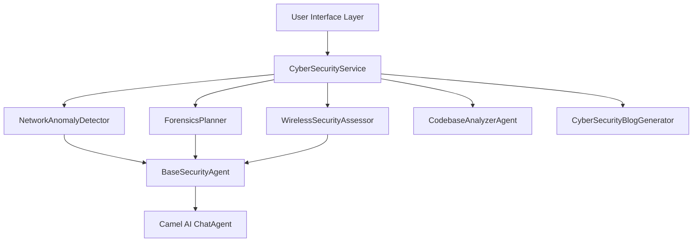
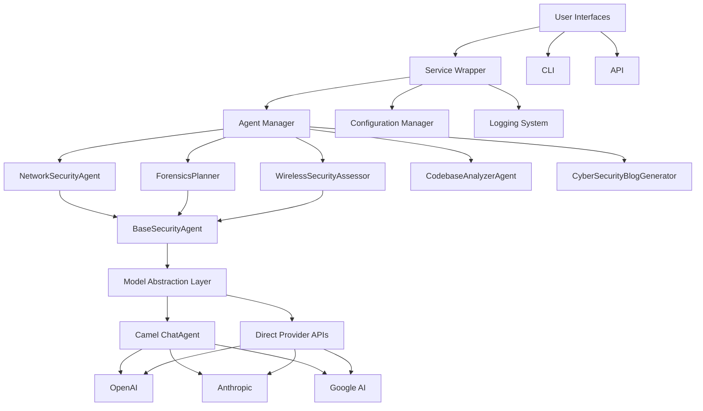

# Comprehensive Guide to Camel AI Framework
# With Cybersecurity Implementation

## Table of Contents
1. [Introduction](#introduction)
2. [Initial Setup and Environment Configuration](#initial-setup)
3. [Core Concepts and Architecture](#core-concepts)
4. [General Camel AI Usage](#general-usage)
5. [Cybersecurity Implementation](#cybersec-impl)
6. [Multi-Agent Interaction](#multi-agent)
7. [Custom Extensions](#custom-extensions)
8. [Detailed Architecture](#architecture)
9. [GCP Deployment Guide](#gcp-deployment)
10. [Monetization Strategies](#monetization)
11. [Best Practices](#best-practices)
12. [Troubleshooting Guide](#troubleshooting)
13. [Advanced Usage Examples](#advanced-usage)
14. [Ethical Considerations](#ethical)

<a name="introduction"></a>
## 1. Introduction

The Camel AI framework (Communicative Agents for "Mind" Exploration and Language) is designed to create and deploy autonomous AI agents that can interact with each other and perform complex tasks. This guide provides a comprehensive overview of both the general Camel AI framework and its specific implementation for cybersecurity applications.

### What is Camel AI?

Camel AI is an open-source framework that enables the creation of cooperative AI agents that can communicate, reason, and solve problems together. It provides:

- Agent architecture with role definitions
- Task structuring and workflows
- Communication patterns between agents
- Integration with multiple AI model providers
- Tools for developing, deploying, and monitoring agent systems

### Cybersecurity Implementation

This codebase extends Camel AI to create specialized cybersecurity agents for:

- Network security analysis
- Digital forensics
- Wireless/mobile security assessment
- Codebase security analysis
- Security blog generation

<a name="initial-setup"></a>
## 2. Initial Setup and Environment Configuration

### Prerequisites

- Python 3.8+
- Access to OpenAI API (or other model providers)
- Basic understanding of cybersecurity concepts (for security features)

### Installation Process

1. Create a Python virtual environment:
   ```bash
   python -m venv venv
   source venv/bin/activate  # On Windows: venv\Scripts\activate
   ```

2. Install the package with dependencies:
   ```bash
   pip install -e ".[dev]"
   ```

### Configuration

1. Create `config/agent_config.yaml`:
   ```yaml
   # Model configuration
   model:
     provider: "openai"  # options: openai, anthropic, google, camel
     openai:
       model_name: "gpt-4-turbo"
       temperature: 0.7
       max_tokens: 4000
     anthropic:
       model_name: "claude-2"
       temperature: 0.7
       max_tokens: 4000

   # Agent configurations
   agents:
     network:
       enabled: true
       system_message: "You are a network security expert..."
     forensics:
       enabled: true
       system_message: "You are a digital forensics investigator..."
     wireless:
       enabled: true
       system_message: "You are a wireless security specialist..."

   # Logging configuration
   logging:
     level: "INFO"
     file: "agent_logs.txt"

   # Codebase analyzer settings
   codebase_analyzer:
     memory:
       db_path: ".agent_memory.db"
   ```

2. Set required environment variables:
   ```bash
   export OPENAI_API_KEY=your_key
   export ANTHROPIC_API_KEY=your_key  # if using Anthropic
   export CAMEL_AI_API_KEY=your_key  # if using Camel AI's hosted service
   export GCP_PROJECT_ID=your_project  # if using Google AI
   ```

### Verification

Test your installation:
```bash
# Using the CLI interface
python -m cybersec_agents.cli run "Analyze network security best practices"

# Using a direct import in Python
from cybersec_agents import CyberSecurityService
service = CyberSecurityService()
result = service.process_command("Analyze network security best practices")
print(result)
```

<a name="core-concepts"></a>
## 3. Core Concepts and Architecture

### Agent Architecture

Camel AI is built around the concept of agents with specific roles and capabilities:

- **Agent**: An autonomous entity with a defined role (e.g., "Network Security Expert")
- **Role**: The specific function or expertise an agent embodies
- **Task**: A specific objective for agents to accomplish
- **System Message**: Defines the agent's role, capabilities, and constraints

### Fundamental Components

1. **ChatAgent**: The core agent class in Camel AI that manages conversations
2. **ModelFactory**: Creates and configures language model instances
3. **SystemMessage**: Defines the agent's role and behavior guidelines
4. **Task**: Structures the goals and context for agents

### Communication Patterns

Agents in Camel AI can communicate through:

1. **Direct exchange**: One agent sends a message to another
2. **Facilitated dialogue**: A coordinator manages exchanges between agents
3. **Task-based collaboration**: Agents work together on a shared task

### Model Integration

Camel AI abstracts away model-specific details, supporting multiple providers:

- OpenAI (GPT models)
- Anthropic (Claude models)
- Google AI (Gemini models)
- And others via the provider interface

<a name="general-usage"></a>
## 4. General Camel AI Usage

### Basic Agent Creation

```python
from camel.agents import ChatAgent
from camel.models import ModelFactory
from camel.types import ModelPlatformType, ModelType

# Create a model
model = ModelFactory.create(
    model_platform=ModelPlatformType.OPENAI,
    model_type=ModelType.GPT_4
)

# Create an agent with a system message
agent = ChatAgent(
    system_message="You are a helpful research assistant specialized in AI technology.",
    model=model
)

# Use the agent
response = agent.step("Explain the concept of multi-agent systems")
print(response.msgs[0].content)
```

### Research Assistant Example

```python
def create_research_agent():
    system_message = """You are an AI research specialist. Your capabilities include:
    1. Conducting literature reviews
    2. Summarizing academic papers
    3. Identifying research gaps
    4. Suggesting methodologies
    5. Analyzing experimental results
    """

    model = ModelFactory.create(
        model_platform=ModelPlatformType.OPENAI,
        model_type=ModelType.GPT_4
    )

    return ChatAgent(system_message=system_message, model=model)

# Usage
agent = create_research_agent()
response = agent.step("Summarize recent developments in large language models")
```

### Content Creation Example

```python
def create_content_agent():
    system_message = """You are a content creation specialist. Your capabilities include:
    1. Writing blog posts and articles
    2. Creating outlines for longer content
    3. Adapting content for different audiences
    4. Suggesting engaging titles and headings
    5. Improving readability and engagement
    """

    model = ModelFactory.create(
        model_platform=ModelPlatformType.OPENAI,
        model_type=ModelType.GPT_4
    )

    return ChatAgent(system_message=system_message, model=model)

# Usage
agent = create_content_agent()
response = agent.step("Create an outline for an article about AI ethics")
```

### Data Analysis Example

```python
def create_data_analysis_agent():
    system_message = """You are a data analysis specialist. Your capabilities include:
    1. Interpreting data patterns and trends
    2. Suggesting appropriate statistical methods
    3. Explaining data visualization approaches
    4. Identifying potential insights from data
    5. Recommending further analysis techniques
    """

    model = ModelFactory.create(
        model_platform=ModelPlatformType.OPENAI,
        model_type=ModelType.GPT_4
    )

    return ChatAgent(system_message=system_message, model=model)

# Usage
agent = create_data_analysis_agent()
response = agent.step("How should I approach analyzing this customer behavior dataset?")
```

<a name="cybersec-impl"></a>
## 5. Cybersecurity Implementation

### Architecture Overview

The cybersecurity implementation extends Camel AI with specialized security agents:



### BaseSecurityAgent

The `BaseSecurityAgent` provides common functionality for all security agents:

```python
class BaseSecurityAgent(ABC):
    def __init__(self, config: Dict):
        self.config = config
        self.provider = config["model"]["provider"]
        self._init_client()

    def execute(self, action: str, params: Dict) -> Dict:
        """Execute an action with logging and error handling"""
        logging.info(f"Executing {action} with params: {params}")
        try:
            self._log_execution_start(action, params)
            result = self._execute_action(action, params)
            self._log_execution_complete(action, result)
            return result
        except Exception as e:
            logging.error(f"Error executing {action}: {str(e)}")
            raise
```

### Agent Types

1. **NetworkAnomalyDetector**
   - Purpose: Analyze network traffic and identify potential security threats
   - Key methods: `analyze_nmap_output()`, `detect_anomalies()`, `generate_security_report()`

2. **ForensicsPlanner**
   - Purpose: Create digital forensics investigation plans
   - Key methods: `generate_investigation_plan()`, `create_evidence_collection_checklist()`

3. **WirelessSecurityAssessor**
   - Purpose: Evaluate wireless network and mobile security
   - Key methods: `analyze_wifi_capture()`, `generate_security_recommendations()`

4. **CodebaseAnalyzerAgent**
   - Purpose: Analyze codebases for security vulnerabilities
   - Key methods: `answer_question()`, `suggest_implementation()`, `explain_code_flow()`

5. **CyberSecurityBlogGenerator**
   - Purpose: Generate technical cybersecurity content
   - Key methods: `generate_blog_post()`, `generate_series()`

### Service Wrapper

The `CyberSecurityService` coordinates agent activities:

```python
class CyberSecurityService:
    def __init__(self, config_path: Optional[str] = None):
        if not config_path:
            config_path = self._find_config()
        self.config = self._load_config(config_path)
        self.setup_logging()
        self.agents = self._initialize_agents()
        self.interaction_history = []

    def process_command(self, command: str, **kwargs) -> Dict:
        """Process commands and route to appropriate agents"""
        logging.info(f"Processing command: {command}")
        steps = self._plan_execution_steps(command, kwargs)
        results = {}
        for step in steps:
            agent = self.agents[step["agent"]]
            result = agent.execute(step["action"], step["params"])
            results[step["agent"]] = result
        self._record_interaction(command, steps, results)
        return results
```

### Command-Line Interface

The CLI provides direct access to agent functionality:

```python
# cli.py
import argparse
import sys
from cybersec_agents import NetworkSecurityAgent, ForensicsPlanner

def main():
    parser = argparse.ArgumentParser(description="Cybersecurity Agents CLI")
    parser.add_argument('command', choices=['network', 'forensics'])
    parser.add_argument('--input', '-i', help="Input file or data")
    parser.add_argument('--output', '-o', help="Output file")

    args = parser.parse_args()

    if args.command == 'network':
        agent = NetworkSecurityAgent()
        result = agent.analyze(args.input)
        # Process result

    elif args.command == 'forensics':
        planner = ForensicsPlanner()
        plan = planner.generate_plan(args.input)
        # Process plan

if __name__ == "__main__":
    main()
```

### API Interface

The API allows web-based access to agent functionality:

```python
# api.py
from flask import Flask, request, jsonify
from cybersec_agents import NetworkSecurityAgent

app = Flask(__name__)
agent = NetworkSecurityAgent()

@app.route('/analyze', methods=['POST'])
def analyze():
    data = request.json
    if not data or 'input' not in data:
        return jsonify({"error": "Missing input data"}), 400

    result = agent.analyze(data['input'])
    return jsonify({"result": result})

if __name__ == "__main__":
    app.run(debug=True)
```

### Application Architecture Diagram

```
A[User] --> B[CLI]
A --> C[API]
B --> E[Agent System]
C --> E
E --> F[External Services]
E --> G[Database]
```

### System Architecture

A comprehensive view of the system architecture:

```
User Interfaces:
- CLI receives user command/request
- API receives HTTP requests

Processing Pipeline:
1. Request validation and parsing
2. Agent selection and initialization
3. Task execution and monitoring
4. Result processing and formatting

Output Handling:
- Formatted to user specifications
- Stored in database if requested
- Displayed to user via CLI or API response
```

<a name="multi-agent"></a>
## 6. Multi-Agent Interaction

### Basic Interaction Pattern

```python
from cybersec_agents import (
    NetworkAnomalyDetector,
    ForensicsPlanner,
    WirelessMobileSecurityAssessor
)

# Initialize agents
network_agent = NetworkAnomalyDetector()
forensics_agent = ForensicsPlanner()
wireless_agent = WirelessMobileSecurityAssessor()

# Network analysis informs forensics planning
network_scan = network_agent.analyze_nmap_output("network_scan.xml")
vulnerable_systems = network_agent.extract_vulnerable_systems(network_scan)

# Create targeted forensics plans
for system in vulnerable_systems:
    plan = forensics_agent.generate_investigation_plan(
        case_type="vulnerability_exploitation",
        target_systems=[system['hostname']]
    )

# Assess wireless security based on findings
if any(system['service'] == 'wifi' for system in vulnerable_systems):
    wireless_recommendations = wireless_agent.generate_security_recommendations(
        network_type="enterprise",
        vulnerabilities_found=True
    )
```

### PCAP Analysis Walkthrough

Here's a detailed walkthrough for analyzing packet capture (PCAP) files:

```python
def analyze_pcap_file(pcap_path):
    """Complete walkthrough of PCAP analysis with multiple agents."""
    # Initialize the service
    service = CyberSecurityService()

    # Step 1: Initial traffic analysis
    network_analysis = service.agents["network"].execute(
        "analyze_pcap",
        {"file_path": pcap_path}
    )

    print("Network Traffic Analysis:")
    print(f"- Packets analyzed: {network_analysis['packet_count']}")
    print(f"- Protocols identified: {', '.join(network_analysis['protocols'])}")
    print(f"- Suspicious connections: {network_analysis['suspicious_count']}")

    # Step 2: If suspicious activity detected, plan forensic investigation
    if network_analysis['suspicious_count'] > 0:
        forensic_plan = service.agents["forensics"].execute(
            "create_investigation_plan",
            {
                "incident_type": "suspicious_traffic",
                "artifacts": [pcap_path],
                "suspicious_ips": network_analysis['suspicious_ips']
            }
        )

        print("\nForensic Investigation Plan:")
        print(f"- Priority: {forensic_plan['priority']}")
        print(f"- Recommended tools: {', '.join(forensic_plan['tools'])}")
        print(f"- Investigation steps:")
        for i, step in enumerate(forensic_plan['steps'], 1):
            print(f"  {i}. {step}")

    # Step 3: Generate actionable recommendations
    recommendations = service.agents["network"].execute(
        "generate_recommendations",
        {
            "analysis_results": network_analysis,
            "context": "network monitoring"
        }
    )

    print("\nActionable Recommendations:")
    for i, rec in enumerate(recommendations['items'], 1):
        print(f"{i}. {rec['title']}")
        print(f"   Priority: {rec['priority']}")
        print(f"   {rec['description']}")
        print()

    return {
        "analysis": network_analysis,
        "forensics": forensic_plan if network_analysis['suspicious_count'] > 0 else None,
        "recommendations": recommendations
    }
```

### Nmap Scan Interpretation

```python
def interpret_nmap_scan(scan_file):
    """Interpret nmap scan results with port analysis."""
    # Initialize service
    service = CyberSecurityService()

    # Analyze nmap output
    scan_analysis = service.agents["network"].execute(
        "analyze_nmap_output",
        {"file_path": scan_file}
    )

    print("Nmap Scan Analysis:")
    print(f"- Hosts scanned: {scan_analysis['host_count']}")
    print(f"- Open ports detected: {scan_analysis['open_port_count']}")

    # Port analysis
    print("\nDetailed Port Analysis:")
    for host, ports in scan_analysis['hosts'].items():
        print(f"\nHost: {host}")
        print("  Open Ports:")
        for port in ports['open_ports']:
            print(f"  - Port {port['number']}/{port['protocol']}: {port['service']}")
            print(f"    Potential vulnerabilities: {', '.join(port['potential_vulnerabilities'])}")
            print(f"    Recommendation: {port['recommendation']}")

    # Generate security assessment
    assessment = service.agents["network"].execute(
        "assess_network_posture",
        {"scan_results": scan_analysis}
    )

    print("\nSecurity Posture Assessment:")
    print(f"- Overall risk level: {assessment['risk_level']}")
    print(f"- Main concerns: {', '.join(assessment['main_concerns'])}")
    print("\nNext Steps:")
    for i, step in enumerate(assessment['next_steps'], 1):
        print(f"{i}. {step}")

    return {
        "scan_analysis": scan_analysis,
        "assessment": assessment
    }
```

<a name="custom-extensions"></a>
## 7. Custom Extensions

### Creating a New Agent

1. Create a new agent class that extends BaseSecurityAgent:

```python
from cybersec_agents.base_agent import BaseSecurityAgent

class MalwareAnalysisAgent(BaseSecurityAgent):
    def __init__(self, config):
        super().__init__(config)

    def _get_system_message(self) -> str:
        return """You are a malware analysis expert. Your task is to:
        1. Analyze suspicious files and identify malware characteristics
        2. Determine malware type and behavior
        3. Suggest containment and remediation steps
        4. Explain technical details in a clear, actionable manner
        5. Provide IOCs (Indicators of Compromise) for monitoring
        """

    def analyze_suspicious_file(self, file_metadata: Dict) -> Dict:
        """Analyze a suspicious file based on its metadata."""
        return self.execute("analyze_file", file_metadata)

    def generate_ioc_list(self, analysis_results: Dict) -> Dict:
        """Generate IOCs based on analysis results."""
        return self.execute("generate_iocs", {"analysis": analysis_results})

    def _get_prompt_template(self, action: str) -> str:
        """Get prompt template for the specific action."""
        templates = {
            "analyze_file": """Analyze this potentially malicious file:

            Filename: {filename}
            File size: {size}
            File type: {file_type}
            SHA256: {sha256}

            Initial observations:
            {observations}

            Provide a detailed analysis including:
            1. Likely malware classification
            2. Behavior analysis
            3. Potential damage assessment
            4. Detection methods
            """,

            "generate_iocs": """Based on the following malware analysis:

            {analysis}

            Generate a comprehensive list of IOCs (Indicators of Compromise) including:
            1. File hashes (MD5, SHA1, SHA256)
            2. Network indicators (IPs, domains, URLs)
            3. Registry keys
            4. File paths
            5. YARA rules (if applicable)
            """
        }
        return templates.get(action, "")

    def _process_response(self, response: str) -> Dict:
        """Process and structure the model's response."""
        # Implementation depends on the expected output format
        # Here's a simple example:
        sections = response.split("\n\n")

        if len(sections) >= 3:
            return {
                "summary": sections[0],
                "details": sections[1],
                "recommendations": sections[2],
                "full_response": response
            }
        else:
            return {"full_response": response}
```

2. Add the new agent to the CyberSecurityService:

```python
# In service_wrapper.py, modify _initialize_agents method:

def _initialize_agents(self) -> Dict:
    """Initialize all agents with proper configuration"""
    return {
        "network": NetworkSecurityAgent(self.config),
        "forensics": ForensicsPlanner(self.config),
        "wireless": WirelessSecurityAssessor(self.config),
        "analyzer": CodebaseAnalyzerAgent(
            project_root=self._find_project_root(),
            memory_db_path=self.config["codebase_analyzer"]["memory"]["db_path"]
        ),
        # Add the new agent here
        "malware": MalwareAnalysisAgent(self.config)
    }
```

3. Update config/agent_config.yaml to include settings for the new agent:

```yaml
agents:
  # ... existing agents
  malware:
    enabled: true
    system_message: "You are a malware analysis expert..."
```

### Customizing System Messages

System messages define an agent's role and capabilities. Here are tips for effective customization:

1. **Be specific about expertise**: Clearly define the agent's domain expertise
2. **List capabilities**: Enumerate what the agent can do
3. **Define limitations**: State what's outside the agent's scope
4. **Set expectations**: Explain the output format and style
5. **Include ethical guidelines**: Establish boundaries for recommendations

Example template:
```
You are a {specialty} expert. Your capabilities include:
1. {capability_1}
2. {capability_2}
3. {capability_3}

When providing {output_type}, you should:
- {guideline_1}
- {guideline_2}
- {guideline_3}

You should NOT:
- {limitation_1}
- {limitation_2}

Always include {required_element} in your responses.
```

<a name="architecture"></a>
## 8. Detailed Architecture

### Component Relationships



### Data Flow

1. **User Input**
   - CLI or API receives user command/request
   - Request is passed to the service wrapper

2. **Command Processing**
   - Service wrapper analyzes command
   - Determines required agents and execution steps
   - Plans multi-agent workflow if needed

3. **Agent Execution**
   - Each agent in workflow is called with specific action and parameters
   - Agent formats prompt using templates
   - AI model generates response
   - Response is processed into structured data

4. **Result Aggregation**
   - Results from all agents are collected
   - Combined into a unified response
   - Interaction is recorded in history

5. **Output Presentation**
   - Formatted according to output preferences
   - Displayed to user via CLI or API

### Key Design Patterns

1. **Facade Pattern** (CyberSecurityService)
   - Provides a simplified interface to the complex system of agents

2. **Strategy Pattern** (BaseSecurityAgent and implementations)
   - Different agent implementations for different security domains

3. **Template Method** (execute method in BaseSecurityAgent)
   - Defines the skeleton of an algorithm, deferring steps to subclasses

4. **Factory Method** (ModelFactory in Camel AI)
   - Creates appropriate model instances based on configuration

5. **Observer Pattern** (logging and interaction history)
   - Maintains a record of all interactions for review and auditing

<a name="gcp-deployment"></a>
## 9. GCP Deployment Guide

### Service Selection

When deploying Camel AI agents to Google Cloud Platform, you have several options:

1. **Google Kubernetes Engine (GKE)**
   - Best for: Complex, scalable deployments with multiple agents
   - Advantages: Auto-scaling, microservices architecture, resource efficiency
   - Considerations: More complex setup, requires containerization

2. **Cloud Functions**
   - Best for: Simple, event-driven agent execution
   - Advantages: Serverless, pay-per-use, minimal maintenance
   - Considerations: Limited execution time, less suitable for complex workflows

3. **Cloud Run**
   - Best for: Containerized agents with HTTP endpoints
   - Advantages: Serverless containers, auto-scaling, stateless
   - Considerations: Requires Docker containerization

4. **Compute Engine**
   - Best for: Full control over infrastructure, complex setups
   - Advantages: Complete customization, persistent workloads
   - Considerations: Requires more management, less auto-scaling

### Deployment Steps

#### 1. Container Preparation

Create a Dockerfile:
```dockerfile
FROM python:3.9-slim

WORKDIR /app

COPY requirements.txt .
RUN pip install --no-cache-dir -r requirements.txt

COPY . .

ENV PYTHONUNBUFFERED=1
ENV MODEL_CONFIG_PATH="/app/config/agent_config.yaml"

EXPOSE 8080

CMD ["gunicorn", "--bind", "0.0.0.0:8080", "cybersec_agents.api:app"]
```

Build and push to Google Container Registry:
```bash
docker build -t gcr.io/[PROJECT_ID]/cybersec-agents .
docker push gcr.io/[PROJECT_ID]/cybersec-agents
```

#### 2. GKE Deployment

Create Kubernetes deployment file (`k8s/deployment.yaml`):
```yaml
apiVersion: apps/v1
kind: Deployment
metadata:
  name: cybersec-agents
spec:
  replicas: 3
  selector:
    matchLabels:
      app: cybersec-agents
  template:
    metadata:
      labels:
        app: cybersec-agents
    spec:
      containers:
      - name: cybersec-agents
        image: gcr.io/[PROJECT_ID]/cybersec-agents
        ports:
        - containerPort: 8080
        env:
        - name: OPENAI_API_KEY
          valueFrom:
            secretKeyRef:
              name: api-keys
              key: openai-api-key
        resources:
          requests:
            memory: "512Mi"
            cpu: "250m"
          limits:
            memory: "1Gi"
            cpu: "500m"
```

Create Kubernetes service file (`k8s/service.yaml`):
```yaml
apiVersion: v1
kind: Service
metadata:
  name: cybersec-agents-service
spec:
  selector:
    app: cybersec-agents
  ports:
  - port: 80
    targetPort: 8080
  type: LoadBalancer
```

Deploy to GKE:
```bash
kubectl apply -f k8s/deployment.yaml
kubectl apply -f k8s/service.yaml
```

#### 3. Cloud Functions Deployment

For serverless deployment of individual agents:

```bash
gcloud functions deploy analyze-network
    --runtime python39
    --trigger-http
    --entry-point analyze_network_endpoint
    --memory 1024MB
    --timeout 540s
    --set-env-vars OPENAI_API_KEY=your_key
```

#### 4. Networking Configuration

1. **External Access**
   - Set up Cloud Load Balancing for GKE services
   - Configure domain name in Cloud DNS
   - Set up SSL certificates using Certificate Manager

2. **Security Measures**
   - Implement Cloud Armor for DDoS protection
   - Use VPC Service Controls to restrict access
   - Configure Identity-Aware Proxy (IAP) for authentication

3. **API Gateway**
   - Set up API Gateway for centralized access control
   - Define API specifications using OpenAPI
   - Configure rate limiting and quotas

#### 5. CI/CD Pipeline

Create a Cloud Build configuration:
```yaml
steps:
  - name: 'gcr.io/cloud-builders/docker'
    args: ['build', '-t', 'gcr.io/$PROJECT_ID/cybersec-agents', '.']

  - name: 'gcr.io/cloud-builders/docker'
    args: ['push', 'gcr.io/$PROJECT_ID/cybersec-agents']

  - name: 'gcr.io/cloud-builders/kubectl'
    args:
      - 'apply'
      - '-f'
      - 'k8s/deployment.yaml'
    env:
      - 'CLOUDSDK_COMPUTE_ZONE=us-central1-a'
      - 'CLOUDSDK_CONTAINER_CLUSTER=camel-ai-cluster'
```

<a name="monetization"></a>
## 10. Monetization Strategies

### API Access Control

Configure API keys in `config/agent_config.yaml`:
```yaml
monetization:
  api_keys:
    enabled: true
    tiers:
      basic: 1000      # Requests per month
      premium: 5000    # Requests per month
      enterprise: unlimited
```

Implementation in the service wrapper:

```python
def validate_api_key(self, api_key: str) -> Dict:
    """Validate API key and return usage information."""
    if not self.config["monetization"]["api_keys"]["enabled"]:
        return {"valid": True, "unlimited": True}

    # Check if key exists in database
    key_info = self.db.get_api_key_info(api_key)
    if not key_info:
        return {"valid": False, "error": "Invalid API key"}

    # Check if key has reached its limit
    if key_info["tier"] == "enterprise":
        return {"valid": True, "unlimited": True}

    usage = self.db.get_monthly_usage(api_key)
    limit = self.config["monetization"]["api_keys"]["tiers"][key_info["tier"]]

    if usage >= limit:
        return {"valid": True, "limited": True, "error": "Monthly limit reached"}

    return {"valid": True, "usage": usage, "limit": limit}
```

### Usage Tracking

Implement usage tracking:

```python
from cybersec_agents import CyberSecurityService

service = CyberSecurityService(
    enable_monetization=True,
    billing_id="customer123"
)

# Usage tracking
usage_stats = service.get_usage_statistics()
print(f"Tokens used: {usage_stats['tokens']}")
print(f"Cost: ${usage_stats['cost']}")
```

Implementation in the service:

```python
def track_usage(self, request_data: Dict) -> None:
    """Track API usage for billing purposes."""
    if not self.enable_monetization:
        return

    # Calculate token usage
    prompt_tokens = len(request_data["prompt"]) // 4  # Approximate
    response_tokens = len(request_data["response"]) // 4  # Approximate

    # Record usage
    self.db.record_usage(
        customer_id=self.billing_id,
        prompt_tokens=prompt_tokens,
        response_tokens=response_tokens,
        timestamp=datetime.now()
    )

def get_usage_statistics(self, time_period: str = "month") -> Dict:
    """Get usage statistics for the specified time period."""
    if not self.enable_monetization:
        return {"error": "Monetization not enabled"}

    # Get usage from database
    usage = self.db.get_usage(self.billing_id, time_period)

    # Calculate costs
    prompt_cost = usage["prompt_tokens"] * 0.00001  # $0.01 per 1000 tokens
    response_cost = usage["response_tokens"] * 0.00003  # $0.03 per 1000 tokens

    return {
        "prompt_tokens": usage["prompt_tokens"],
        "response_tokens": usage["response_tokens"],
        "total_tokens": usage["prompt_tokens"] + usage["response_tokens"],
        "prompt_cost": prompt_cost,
        "response_cost": response_cost,
        "cost": prompt_cost + response_cost,
        "time_period": time_period
    }
```

### Payment Integration

1. Stripe setup in `monetization_setup.py`:

```python
import stripe
stripe.api_key = "sk_test_..."

# Tier price IDs from Stripe dashboard
tier_prices = {
    "basic": "price_basic123",
    "premium": "price_premium456",
    "enterprise": "price_enterprise789"
}

def process_subscription(customer_id, tier):
    """Create or update a subscription."""
    return stripe.Subscription.create(
        customer=customer_id,
        items=[{"price": tier_prices[tier]}]
    )

def create_customer(email, name):
    """Create a new customer in Stripe."""
    return stripe.Customer.create(
        email=email,
        name=name
    )

def generate_api_key(customer_id, tier):
    """Generate API key and store in database."""
    # Generate secure random key
    api_key = f"sk_{secrets.token_urlsafe(32)}"

    # Store in database with tier information
    db.store_api_key(api_key, customer_id, tier)

    return api_key
```

2. Subscription management API:

```python
from flask import Flask, request, jsonify
from monetization_setup import create_customer, process_subscription, generate_api_key

app = Flask(__name__)

@app.route('/subscribe', methods=['POST'])
def subscribe():
    data = request.json

    # Create or get customer
    if data.get('customer_id'):
        customer_id = data['customer_id']
    else:
        customer = create_customer(data['email'], data['name'])
        customer_id = customer.id

    # Process subscription
    subscription = process_subscription(customer_id, data['tier'])

    # Generate API key
    api_key = generate_api_key(customer_id, data['tier'])

    return jsonify({
        'customer_id': customer_id,
        'subscription_id': subscription.id,
        'api_key': api_key,
        'tier': data['tier']
    })
```

### Usage-Based Billing Models

1. **Per-Request Pricing**
   - Charge per API call
   - Simple to implement and understand
   - Example: $0.01 per agent request

2. **Token-Based Pricing**
   - Charge based on tokens processed
   - More closely aligned with actual costs
   - Example: $0.01 per 1000 input tokens, $0.03 per 1000 output tokens

3. **Subscription Tiers**
   - Basic: 1000 requests/month for $29
   - Premium: 5000 requests/month for $99
   - Enterprise: Unlimited requests for $499

4. **Hybrid Models**
   - Base subscription with overage charges
   - Different rates for different agent types
   - Volume discounts for high usage

<a name="best-practices"></a>
## 11. Best Practices

### Code Organization

1. **Modular Design**
   - Keep each agent in its own module
   - Separate business logic from AI interactions
   - Use inheritance for common functionality

2. **Comprehensive Logging**
   ```python
   import logging

   # Setup logging
   logging.basicConfig(
       level=logging.INFO,
       format='%(asctime)s [%(levelname)s] %(name)s: %(message)s',
       handlers=[
           logging.FileHandler("agent.log"),
           logging.StreamHandler()
       ]
   )

   # Usage
   logger = logging.getLogger(__name__)
   logger.info("Agent initialized")
   logger.warning("Unusual pattern detected")
   logger.error("Failed to connect to API", exc_info=True)
   ```

3. **Type Hints and Docstrings**
   ```python
   from typing import Dict, List, Optional

   def analyze_traffic(
       data: Dict[str, any],
       threshold: Optional[float] = 0.7
   ) -> List[Dict[str, any]]:
       """
       Analyze network traffic for suspicious patterns.

       Args:
           data: Dictionary containing traffic data
           threshold: Detection sensitivity (0.0-1.0)

       Returns:
           List of dictionaries containing detected anomalies

       Raises:
           ValueError: If threshold is outside valid range
       """
       if threshold < 0.0 or threshold > 1.0:
           raise ValueError("Threshold must be between 0.0 and 1.0")

       # Implementation...
   ```

4. **Test Coverage**
   ```python
   import unittest
   from unittest.mock import patch

   class TestNetworkAgent(unittest.TestCase):
       def setUp(self):
           self.agent = NetworkSecurityAgent(config={"model": {"provider": "test"}})

       @patch("cybersec_agents.network_security_agent._get_model_response")
       def test_analyze_traffic(self, mock_model):
           mock_model.return_value = "Test response"
           result = self.agent.analyze_traffic({"test": "data"})
           self.assertIn("analysis", result)
   ```

### Security Considerations

1. **API Key Storage**
   - Store API keys in environment variables
   - Never commit API keys to source control
   - Use a service like Google Secret Manager for production

2. **Input Validation**
   ```python
   def validate_input(data):
       required_fields = ["command", "parameters"]
       for field in required_fields:
           if field not in data:
               return False, f"Missing required field: {field}"

       if not isinstance(data["parameters"], dict):
           return False, "Parameters must be an object"

       return True, "Valid input"
   ```

3. **Rate Limiting**
   ```python
   from flask_limiter import Limiter
   from flask_limiter.util import get_remote_address

   limiter = Limiter(
       app,
       key_func=get_remote_address,
       default_limits=["100 per day", "10 per hour"]
   )

   @app.route('/analyze')
   @limiter.limit("10 per minute")
   def analyze():
       # Implementation
   ```

4. **Access Control**
   ```python
   from functools import wraps
   from flask import request, jsonify

   def require_api_key(f):
       @wraps(f)
       def decorated_function(*args, **kwargs):
           api_key = request.headers.get('X-API-Key')
           if not api_key:
               return jsonify({"error": "API key required"}), 401

           validation = validate_api_key(api_key)
           if not validation["valid"]:
               return jsonify({"error": validation["error"]}), 401

           return f(*args, **kwargs)
       return decorated_function

   @app.route('/secure-endpoint')
   @require_api_key
   def secure_endpoint():
       # Implementation
   ```

### Scalability

1. **Caching**
   ```python
   from functools import lru_cache

   @lru_cache(maxsize=100)
   def get_response_for_prompt(prompt):
       """Cache identical prompts to reduce API calls."""
       return model.get_response(prompt)
   ```

2. **Async Operations**
   ```python
   import asyncio

   async def process_multiple_agents(command, agents):
       """Process command through multiple agents concurrently."""
       tasks = [agent.execute_async(command) for agent in agents]
       results = await asyncio.gather(*tasks)
       return results
   ```

3. **Auto-Scaling**
   For container-based deployments, configure auto-scaling:
   ```yaml
   apiVersion: autoscaling/v2beta2
   kind: HorizontalPodAutoscaler
   metadata:
     name: cybersec-agents-hpa
   spec:
     scaleTargetRef:
       apiVersion: apps/v1
       kind: Deployment
       name: cybersec-agents
     minReplicas: 2
     maxReplicas: 10
     metrics:
     - type: Resource
       resource:
         name: cpu
         target:
           type: Utilization
           averageUtilization: 70
   ```

4. **Resource Monitoring**
   ```python
   import psutil

   def monitor_resources():
       """Monitor system resources."""
       memory = psutil.virtual_memory()
       cpu = psutil.cpu_percent(interval=1)

       if memory.percent > 90 or cpu > 85:
           logging.warning(f"High resource usage: Memory {memory.percent}%, CPU {cpu}%")

       return {
           "memory_percent": memory.percent,
           "cpu_percent": cpu,
           "disk_percent": psutil.disk_usage('/').percent
       }
   ```

### Maintenance

1. **Regular Dependency Updates**
   - Use a tool like Dependabot to keep dependencies updated
   - Regularly run `pip list --outdated` to check for updates
   - Maintain a changelog of dependency updates

2. **Performance Monitoring**
   ```python
   import time
   from functools import wraps

   def timing_decorator(f):
       @wraps(f)
       def wrapper(*args, **kwargs):
           start = time.time()
           result = f(*args, **kwargs)
           end = time.time()
           duration = end - start

           logging.info(f"Function {f.__name__} took {duration:.2f} seconds")

           if duration > 5.0:
               logging.warning(f"Slow execution: {f.__name__} took {duration:.2f} seconds")

           return result
       return wrapper
   ```

3. **Error Tracking**
   ```python
   def track_error(error, context=None):
       """Track errors for later analysis."""
       error_data = {
           "timestamp": datetime.now().isoformat(),
           "error_type": type(error).__name__,
           "message": str(error),
           "context": context or {},
           "traceback": traceback.format_exc()
       }

       # Log error
       logging.error(f"Error: {error_data['error_type']}: {error_data['message']}")

       # Store error in database for analysis
       db.store_error(error_data)

       # Optionally send to external error tracking service
       if sentry_enabled:
           sentry_sdk.capture_exception(error)
   ```

4. **Documentation Updates**
   - Update README.md with new features and changes
   - Maintain detailed API documentation
   - Create and update examples for new functionality
   - Consider using a tool like Sphinx for automated documentation

<a name="troubleshooting"></a>
## 12. Troubleshooting Guide

### Common Issues and Solutions

#### 1. API Key Configuration

**Issue**: "Authentication error" or "Invalid API key" errors when using agents.

**Solution**:
- Check environment variables: `echo $OPENAI_API_KEY`
- Ensure keys are properly set in your config.yaml
- Verify API key validity with a simple test request
- Check for whitespace in API keys

#### 2. Model Timeout Errors

**Issue**: "Request timed out" errors when making large requests.

**Solution**:
- Increase timeout settings in your configuration
- Break large prompts into smaller chunks
- Implement retry logic with exponential backoff:
  ```python
  import time

  def retry_with_backoff(func, max_retries=3):
      retries = 0
      while retries < max_retries:
          try:
              return func()
          except Exception as e:
              retries += 1
              if retries == max_retries:
                  raise
              wait_time = 2 ** retries  # Exponential backoff
              print(f"Retrying in {wait_time} seconds...")
              time.sleep(wait_time)
  ```

#### 3. Memory Issues

**Issue**: "Out of memory" errors when processing large datasets.

**Solution**:
- Implement batch processing for large datasets
- Release resources after use
- Monitor memory usage with tools like psutil
- Increase container memory limits in deployment

#### 4. Response Parsing Errors

**Issue**: Errors when parsing model responses into structured data.

**Solution**:
- Improve system messages to enforce response formats
- Implement more robust parsing logic
- Add fallback handling for unexpected response formats:
  ```python
  def parse_response(response):
      try:
          # Try to parse as JSON
          return json.loads(response)
      except json.JSONDecodeError:
          try:
              # Try to extract JSON using regex
              import re
              json_match = re.search(r'```json\n(.*?)\n```', response, re.DOTALL)
              if json_match:
                  return json.loads(json_match.group(1))
          except:
              pass

          # Fallback to simple structure
          return {
              "raw_response": response,
              "parsed": False,
              "error": "Could not parse response as JSON"
          }
  ```

### Debugging Techniques

1. **Enable Verbose Logging**
   ```python
   import logging
   logging.basicConfig(level=logging.DEBUG)
   ```

2. **Inspect Intermediate Results**
   ```python
   def debug_agent(agent, prompt):
       """Debug agent responses step by step."""
       print(f"PROMPT: {prompt}")

       # Format prompt
       formatted = agent._format_prompt("analyze", {"input": prompt})
       print(f"\nFORMATTED PROMPT: {formatted}")

       # Get raw response
       response = agent._get_model_response(formatted)
       print(f"\nRAW RESPONSE: {response}")

       # Process response
       structured = agent._process_response(response)
       print(f"\nSTRUCTURED RESPONSE: {json.dumps(structured, indent=2)}")

       return structured
   ```

3. **API Response Inspection**
   ```python
   import openai

   # Enable debug mode
   openai.debug = True

   # Or manually log requests and responses
   def log_api_call(api_name, request_data, response_data):
       with open("api_log.txt", "a") as f:
           f.write(f"--- {api_name} at {datetime.now().isoformat()} ---\n")
           f.write(f"REQUEST: {json.dumps(request_data, indent=2)}\n")
           f.write(f"RESPONSE: {json.dumps(response_data, indent=2)}\n\n")
   ```

4. **Component Isolation**
   When troubleshooting complex systems, isolate components:
   ```python
   # Test only the model interaction
   def test_model_directly():
       """Test direct model interaction."""
       model = ModelFactory.create(
           model_platform=ModelPlatformType.OPENAI,
           model_type=ModelType.GPT_4
       )

       response = model.get_response("Explain the concept of cybersecurity in one paragraph.")
       print(f"Direct model response: {response}")
   ```

<a name="advanced-usage"></a>
## 13. Advanced Usage Examples

### External Data Integration

Integrate external data sources with agents:

```python
import requests
from cybersec_agents import NetworkSecurityAgent

class EnhancedNetworkAgent(NetworkSecurityAgent):
    def __init__(self, config):
        super().__init__(config)
        self.threat_intel_api_key = os.environ.get("THREATINTEL_API_KEY")

    def analyze_ip(self, ip_address):
        """Analyze IP using both AI and threat intelligence data."""
        # Get threat intelligence data
        threat_data = self._get_threat_intel(ip_address)

        # Enhance prompt with threat data
        enhanced_params = {
            "ip": ip_address,
            "threat_data": json.dumps(threat_data),
            "context": "security analysis"
        }

        # Get AI analysis
        analysis = self.execute("analyze_ip", enhanced_params)

        # Combine results
        return {
            "ip": ip_address,
            "threat_intel": threat_data,
            "ai_analysis": analysis,
            "risk_score": self._calculate_risk_score(threat_data, analysis)
        }

    def _get_threat_intel(self, ip_address):
        """Get threat intelligence data for IP."""
        response = requests.get(
            f"https://api.threatintel.com/v1/ip/{ip_address}",
            headers={"X-API-Key": self.threat_intel_api_key}
        )

        if response.status_code == 200:
            return response.json()
        else:
            logging.warning(f"Failed to get threat intel: {response.status_code}")
            return {"error": "Failed to retrieve threat intelligence"}
```

### Multi-Model Implementation

Combine results from multiple AI models:

```python
async def analyze_with_multiple_providers(text_to_analyze):
    """Analyze text using multiple providers and combine results."""
    providers = ["openai", "anthropic", "google"]
    results = {}

    async with asyncio.TaskGroup() as tg:
        for provider in providers:
            results[provider] = tg.create_task(
                analyze_with_provider(provider, text_to_analyze)
            )

    # Extract results from completed tasks
    final_results = {p: r.result() for p, r in results.items()}

    # Combine and analyze results
    return aggregate_results(final_results)

async def analyze_with_provider(provider, text):
    """Analyze text with a specific provider."""
    agent = NetworkSecurityAgent(provider=provider)
    return await agent.analyze_text_async(text)

def aggregate_results(provider_results):
    """Aggregate and compare results from different providers."""
    # Extract entities detected by each provider
    all_entities = set()
    provider_entities = {}

    for provider, result in provider_results.items():
        provider_entities[provider] = set(result["entities"])
        all_entities.update(provider_entities[provider])

    # Calculate agreement between providers
    agreement_scores = {}
    for entity in all_entities:
        detected_by = [p for p, entities in provider_entities.items()
                      if entity in entities]
        agreement_scores[entity] = len(detected_by) / len(provider_results)

    # Sort entities by agreement score
    sorted_entities = sorted(
        agreement_scores.items(),
        key=lambda x: x[1],
        reverse=True
    )

    return {
        "provider_results": provider_results,
        "entities_by_agreement": sorted_entities,
        "high_confidence_entities": [e for e, score in sorted_entities
                                    if score >= 0.7]
    }
```

### Complex Workflow Example

```python
async def comprehensive_security_audit(target_network):
    """Perform a comprehensive security audit using multiple agents."""
    # Initialize service
    service = CyberSecurityService()

    # Step 1: Network scanning and analysis
    logging.info("Starting network scanning phase")
    scan_results = await service.agents["network"].execute_async(
        "perform_network_scan",
        {"target": target_network, "scan_type": "comprehensive"}
    )

    # Step 2: Vulnerability assessment
    logging.info("Starting vulnerability assessment phase")
    vulnerabilities = await service.agents["network"].execute_async(
        "assess_vulnerabilities",
        {"scan_results": scan_results}
    )

    # Step 3: Threat modeling
    logging.info("Starting threat modeling phase")
    threats = await service.agents["forensics"].execute_async(
        "model_threats",
        {"vulnerabilities": vulnerabilities, "network": target_network}
    )

    # Step 4: Risk assessment
    logging.info("Starting risk assessment phase")
    risks = [
        {
            "vulnerability": v,
            "threats": [t for t in threats if t["relates_to"] == v["id"]],
            "score": calculate_risk_score(v, threats)
        }
        for v in vulnerabilities
    ]

    # Step 5: Generate mitigation plan
    logging.info("Generating mitigation plans")
    mitigation_tasks = []
    for risk in sorted(risks, key=lambda r: r["score"], reverse=True):
        task = service.agents["forensics"].execute_async(
            "generate_mitigation_plan",
            {"risk": risk}
        )
        mitigation_tasks.append(task)

    mitigation_plans = await asyncio.gather(*mitigation_tasks)

    # Step 6: Generate executive summary
    logging.info("Generating executive summary")
    executive_summary = await service.agents["network"].execute_async(
        "generate_executive_summary",
        {
            "scan_results": scan_results,
            "vulnerabilities": vulnerabilities,
            "risks": risks,
            "mitigation_plans": mitigation_plans
        }
    )

    # Step 7: Compile comprehensive report
    logging.info("Compiling final report")
    return {
        "executive_summary": executive_summary,
        "technical_details": {
            "scan_results": scan_results,
            "vulnerabilities": vulnerabilities,
            "threats": threats,
            "risks": risks,
        },
        "mitigation_plans": mitigation_plans,
        "timestamp": datetime.now().isoformat()
    }
```

<a name="ethical"></a>
## 14. Ethical Considerations

### Responsible AI Usage

1. **Transparency**
   - Clearly disclose when users are interacting with AI agents
   - Explain the capabilities and limitations of the system
   - Provide information about how results are generated

2. **Oversight and Accountability**
   - Implement human review for critical security recommendations
   - Maintain audit logs of agent activities
   - Establish clear accountability for AI-generated actions

3. **Bias Mitigation**
   - Regularly evaluate agents for potential biases
   - Use diverse training data and examples
   - Implement fairness checks in your prompts

4. **Privacy Protection**
   - Minimize data collection and retention
   - Secure all stored data
   - Obtain proper consent before analyzing sensitive information

### Implementation Considerations

1. **Human-in-the-Loop Design**
   ```python
   def generate_high_risk_recommendation(analysis_result):
       """Generate security recommendations with human oversight."""
       # Get AI recommendation
       recommendation = service.agents["network"].execute(
           "generate_recommendation",
           {"analysis": analysis_result, "risk_level": "high"}
       )

       # Flag for human review if contains certain actions
       high_risk_actions = ["shutdown", "isolate", "block"]
       needs_review = any(action in recommendation["actions"]
                         for action in high_risk_actions)

       if needs_review:
           # Queue for human review
           review_id = review_queue.add_item(
               recommendation,
               analysis_result
           )
           return {
               "status": "pending_review",
               "review_id": review_id,
               "preliminary_recommendation": recommendation
           }
       else:
           return {
               "status": "approved",
               "recommendation": recommendation
           }
   ```

2. **Ethical Guidelines in System Messages**
   Include ethical guidelines in agent system messages:
   ```
   You are a cybersecurity expert. Your task is to analyze security data and provide recommendations.

   Ethical Guidelines:
   1. Always prioritize user safety and data protection
   2. Avoid recommending illegal or harmful actions
   3. Clearly indicate limitations and uncertainties in your analysis
   4. Present multiple options when appropriate
   5. Consider potential unintended consequences of recommendations
   ```

3. **Regular Ethical Reviews**
   Implement a process for regular ethical reviews:
   ```python
   def perform_ethical_review():
       """Perform ethical review of the system."""
       # Get recent interactions
       recent = db.get_recent_interactions(limit=100)

       # Sample random interactions for review
       sample = random.sample(recent, min(20, len(recent)))

       # Check against ethical guidelines
       ethics_checklist = [
           "No PII in logs",
           "No harmful recommendations",
           "Limitations clearly stated",
           "Multiple options provided",
           "Balanced risk assessment"
       ]

       issues = []
       for interaction in sample:
           for guideline in ethics_checklist:
               if not check_guideline(interaction, guideline):
                   issues.append({
                       "interaction_id": interaction["id"],
                       "guideline": guideline,
                       "severity": assess_severity(guideline),
                       "details": get_violation_details(interaction, guideline)
                   })

       return {
           "sample_size": len(sample),
           "issues_found": len(issues),
           "issues": issues
       }
   ```

By following the principles and practices outlined in this comprehensive guide, you can effectively leverage the Camel AI framework for cybersecurity applications while ensuring responsible and ethical implementation.
